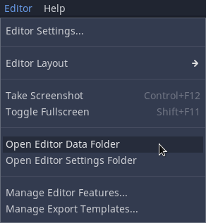
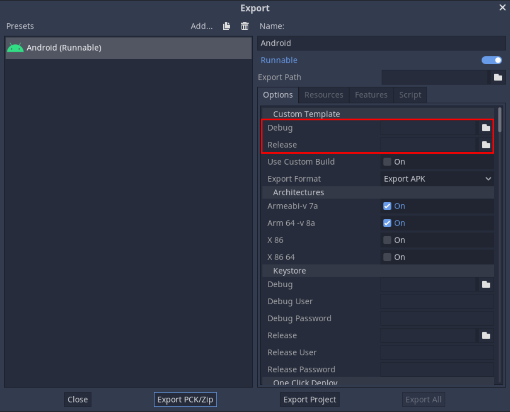

Build Rebel Engine for Android
==============================

.. note::

    This page describes how to build Rebel Engine for Android.
    If you want to export your game for Android, see :doc:`/tutorials/export/exporting_for_android`.
    If you want to create a custom build for Android, also see :doc:`/tutorials/export/exporting_for_android`.
    If you want to contribute to Rebel Engine's Android platform, keep reading.

To build Rebel Engine for Android, you will need to:

#. `Install the required software`_
#. `Configure the build environment`_
#. `Compile Rebel Engine for Android`_
#. `Create the Rebel Engine Android templates`_
#. `Apply the templates`_

Install the required software
-----------------------------

Rebel Engine for Android can be built on Linux, macOS and Windows.
To build Rebel Engine for Android, the following software is required:

*  `Python 3.8+ <https://www.python.org/downloads/>`__.
*  `SCons 4.1+ <https://scons.org/pages/download.html>`__ build system.
*  OpenJDK 17 JDK: We recommend either:

    * `Temurin <https://adoptium.net/temurin/releases/?version=17>`__
    * `Azul <https://www.azul.com/downloads/?version=java-17-lts#zulu>`__

*  `Android SDK command line tools <https://developer.android.com/studio/>`__

.. note::

    Installing Android Studio will not install the command line tools by default.
    You can download and install the command line tools only, or
    use the Android Studio SDK manager to install the latest command line tools.

Configure the build environment
--------------------------------

See :doc:`getting_source` to get a copy of the Rebel Engine source code.

For a general overview of SCons usage for Rebel Engine, see :doc:`introduction_to_the_buildsystem`.

Set the environment variable ``ANDROID_HOME`` to point to the folder where the Android command-line tools are installed.

.. note::
    Do not set the ``ANDROID_HOME`` to point to the command-line tools folder itself.
    Set the ``ANDROID_HOME`` to point to the folder that contains the command-line tools folder.
    If you installed Android Studio and used Android Studio SDK manager to install the command-line tools,
    set ``ANDROID_HOME`` to point to the ``Android/Sdk`` folder.

Compile Rebel Engine for Android
--------------------------------

To compile Rebel Engine for Android, from the command line run:

.. code:: sh

    scons platform=android

By default, the build system will target the debug arm64-v8a (`AArch64 <https://en.wikipedia.org/wiki/AArch64>`__) version of Rebel Engine.
To create the release and debug `Android build variants <https://developer.android.com/build/build-variants>`__ of the Rebel Engine Android templates,
the target option should be set to ``release_debug`` and ``release`` respectively.
See :doc:`introduction_to_the_buildsystem` for more information on Rebel Engine targets.
For example, to compile Rebel Engine for Android targeting the ``release`` (arm64-v8a) build variant run:

.. code:: sh

    scons platform=android target=release

Rebel Engine can be compiled for the following `Android ABIs <https://developer.android.com/ndk/guides/abis>`__:

* armeabi-v7a
* arm64-v8a
* x86
* x86_64

You specify the target Android ABI using the ``android_arch`` option with ``armv7``, ``arm64v8``, ``x86`` or ``x86_64``.
For example, to compile Rebel Engine for Android targeting the ``release`` variant and the ``armeabi-v7a`` ABI run:

.. code:: sh

    scons platform=android target=release android_arch=armv7

.. note::

    Almost all ARMv7 Android devices support `Neon <https://developer.android.com/ndk/guides/cpu-arm-neon>`__.
    Therefore, Neon is enabled by default, and all pre-built Rebel Engine Android templates have Neon enabled.
    To support an ARMv7 device that does not support Neon, you will need to build Rebel Engine for Android ARMv7 with Neon disabled.
    Add the ``android_neon=false`` option when targeting ``android_arch=armv7``.

.. note::

    Rebel Engine for Android is built to support all devices running Android 5 (Lollipop) and above.
    Android 5 was released in 2014, and Rebel Engine supports 99.5% of all Android devices.
    Android 5 requires a minimum Android SDK/API of 21.
    If you are compiling Rebel Engine for Android to add functionality only available in a newer SDK/API,
    you can set the NDK minimum Android SDK/API supported using the ``android_ndk_api`` option.
    For example, to use a minimum Android SDK of 29 (Android 10 and newer devices only), use ``android_ndk_api=29``.

The Rebel Engine Android templates contain both the ``release`` and ``release_debug`` build variants for each of the Android ABIs.
To compile the full suite of Android variants you will need to compile Rebel Engine for Android 8 times:

.. code:: sh

    scons platform=android target=release android_arch=armv7
    scons platform=android target=release_debug android_arch=armv7
    scons platform=android target=release android_arch=arm64v8
    scons platform=android target=release_debug android_arch=arm64v8
    scons platform=android target=release android_arch=x86
    scons platform=android target=release_debug android_arch=x86
    scons platform=android target=release android_arch=x86_64
    scons platform=android target=release_debug android_arch=x86_64

The Rebel Engine build system will automatically copy the compiled Rebel Engine library into the correct Android project folder.
The Rebel Engine build system will also automatically copy the desired ABI's ``libc++_shared.so`` library into the correct Android project folder.

Create the Rebel Engine Android templates
-----------------------------------------

Rebel Engine Android templates are created using `Gradle tasks <https://docs.gradle.org/current/userguide/tutorial_using_tasks.html>`__.

.. note::
    Rebel Engine source files include the `Gradle wrapper <https://docs.gradle.org/current/userguide/gradle_wrapper.html>`__, so
    you do not need to install the `Gradle build software <https://gradle.org/>`__.

To create the Rebel Engine Android templates, change to the ``platform/android/project`` directory and run the ``createAndroidTemplates`` Gradle task:

.. tabs::

    .. group-tab:: Linux

        .. code:: sh

            cd platform/android/project
            ./gradlew createAndroidTemplates

    .. group-tab:: macOS

        .. code:: sh

            cd platform/android/project
            ./gradlew createAndroidTemplates

    .. group-tab:: Windows

        .. code:: sh

            cd platform\android\project
            .\gradlew.bat createAndroidTemplates

The ``createAndroidTemplates`` task creates Android package (APK) templates that will be updated by Rebel Editor when exporting for Android.
The ``createAndroidTemplates`` task detects whether any release or debug build variants have been compiled.
Rebel Engine Android APK templates will only be created for build variants that have been compiled.
The release APK template is called ``android_release.apk``.
The debug APK template is called ``android_debug.apk``.
The created Rebel Engine Android APK template files are copied into the Rebel Engine ``bin`` directory.

The ``createAndroidTemplates`` task detects the Android ABIs for each build variant that has been previously compiled.
Rebel Engine Android template APKs will automatically include the Rebel Engine libraries and required shared libraries for all the ABIs that have been previously compiled.

The ``createAndroidTemplates`` task will also create an Android project template that can be used to create Rebel Engine Android custom builds.
The Rebel Engine Android project template includes the Rebel Engine library as an Android archive (``.aar``) file for each build variant detected.
Rebel Engine library Android archive files will only be created for build variants that have been previously compiled.
The Rebel Engine Android project template is compressed into a zip file called ``android_template.zip`` and saved in the Rebel Engine ``bin`` directory.

Finally, the ``createAndroidTemplates`` task will copy the created Rebel Engine library Android archive files ``engine-release.aar`` and ``engine-debug.aar`` into the ``bin`` directory.

.. note::

    The ``createAndroidTemplates`` task will detect and include any previously compiled Android variants in the templates.
    To avoid including old versions of the library for variants that are not desired,
    before compiling the variants to be included, first run:

    .. tabs::

        .. group-tab:: Linux

            .. code:: sh

                ./gradlew cleanAndroidTemplates

        .. group-tab:: macOS

            .. code:: sh

                ./gradlew cleanAndroidTemplates

        .. group-tab:: Windows

            .. code:: sh

                .\gradlew.bat cleanAndroidTemplates

.. note::

    The ``createAndroidTemplates`` task will strip debug symbols from the Rebel Engine libraries.
    To keep the debug symbols use ``createDevelopmentAndroidTemplates`` instead:

    .. tabs::

        .. group-tab:: Linux

            .. code:: sh

                ./gradlew createDevelopmentAndroidTemplates

        .. group-tab:: macOS

            .. code:: sh

                ./gradlew createDevelopmentAndroidTemplates

        .. group-tab:: Windows

            .. code:: sh

                .\gradlew.bat createDevelopmentAndroidTemplates

Apply the templates
-------------------

The Rebel Engine Android templates that you created can be applied in two ways:

#. `Apply Rebel Engine Android templates to all games`_
#. `Apply Rebel Engine Android templates to a single game`_

Apply Rebel Engine Android templates to all games
^^^^^^^^^^^^^^^^^^^^^^^^^^^^^^^^^^^^^^^^^^^^^^^^^

The Rebel Engine Android templates you created can be applied to all games by copying them into Rebel Editor's shared templates folder.
To find the Rebel Editor's shared templates folder, open Rebel Editor.
From the Editor menu, select ``Open Editor Data Folder``.

    Rebel Editor's Editor menu's Open Editor Data Folder

If you have installed the Rebel Editor export templates, the Rebel Editor data folder will contain a templates folder.
In the templates folder there is a folder for each version of Rebel Editor.
Into the version folder that matches your version of Rebel Editor,
copy the ``android_release.apk``, ``android_debug.apk`` and ``android_template.zip`` that you created.

.. note:

    The version of Rebel Engine templates must match the version of Rebel Editor.
    When exporting, Rebel Editor will update the Rebel Engine templates.
    Therefore, Rebel Editor expects to find specific files, classes, properties, etc. in the Rebel Engine templates.
    If any of these are changed, the Rebel Editor export needs to be updated too.

.. note:

    For custom builds, existing games will need their Android project template reinstalled.
    See :doc:`exporting_for_android` for details.

Apply Rebel Engine Android templates to a single game
^^^^^^^^^^^^^^^^^^^^^^^^^^^^^^^^^^^^^^^^^^^^^^^^^^^^^

The Rebel Engine Android APK templates you created can be applied to a single game by pointing to them in Rebel Editor's export manager for Android.

    Rebel Editor's Android export custom template options

The Rebel Engine Android custom build project template you created can be applied to a single game.
Simply extract the contents of the ``android_template.zip`` file you created into the game's ``android/project`` folder.
