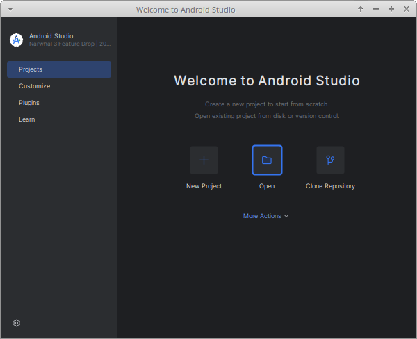
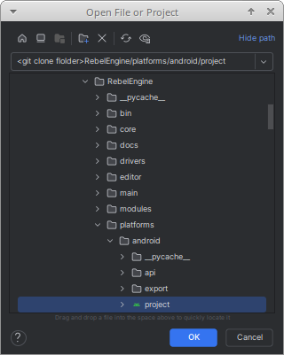
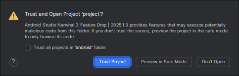
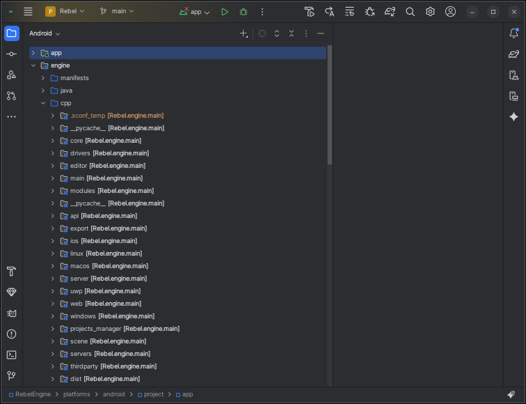
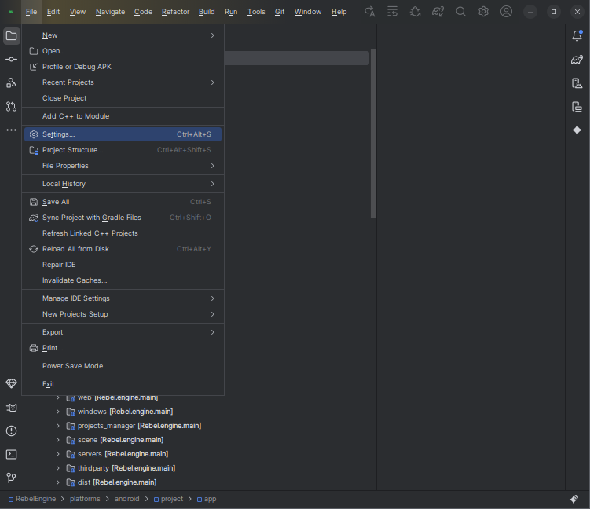
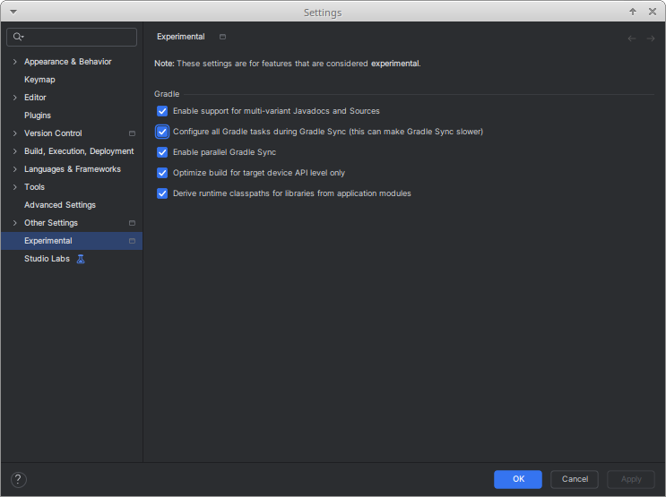
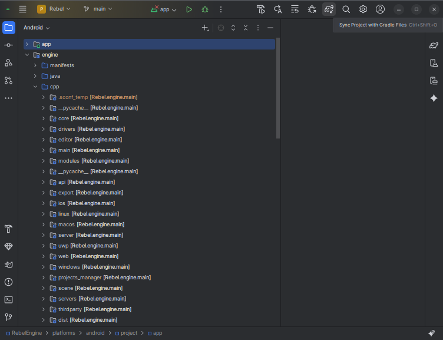
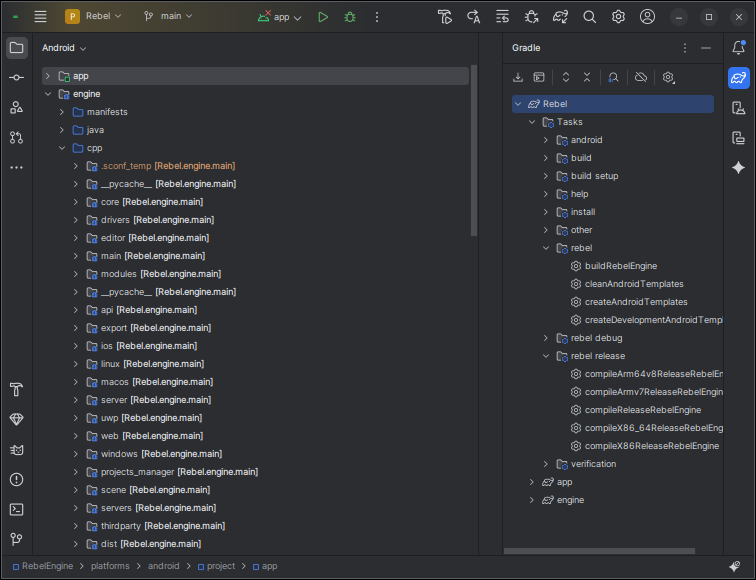

Android Studio
==============

`Android Studio <https://developer.android.com/studio>`__ is a free `JetBrains <https://www.jetbrains.com/>`__ IDE for Android app development.
Android Studio can also be used to develop C and C++ libraries that are packaged with an Android app.
Rebel Engine for Android is a C++ library used to create Android games.
If you want to contribute to Rebel Engine for Android, it makes sense to use Android Studio.

Open the Rebel Android project
------------------------------

In the **Welcome to Android Studio** window, select **Open**.

   Welcome to Android Studio

In the **Open File or Project** window,
from the RebelEngine root folder,
browse to and select the `platforms/android/project` folder.

   Open "RebelEngine/platforms/android/project" folder

Click **OK**.

Click **Trust Project** when asked whether to **Trust and Open Project 'project'?**

   Trust the project

Wait for Android Studio to import the Gradle project.

When complete, the Rebel Engine source code can be found in the **engine** module's **cpp** folder.

   Android engine module cpp files

Configure the Rebel Gradle tasks
--------------------------------

There are a number of Gradle tasks.
These tasks can be used to build debug and release versions of Rebel Engine for Android.
Rebel Engine for Android supports multiple architectures.
There are tasks for each of the supported target architectures.
There are also tasks for building all the targets simultaneously.
Finally, there are tasks to create the release and debug versions of the Rebel Android templates.

To configure the Gradle tasks in Android Studio, you will need to enable the Gradle Setting.
From the menu select **File > Settings...**.

   Settings...

Under **Experimental**, enable **Configure all Gradle tasks during Gradle Sync (this can make Gradle Sync slower)**.

   Configure all Gradle tasks during Gradle Sync (this can make Gradle Sync slower)

Click **OK** to save the setting.

Sync the project with Gradle again.

   Sync the project with Gradle Files

Under the Gradle menu,
you will now see all the Rebel Android tasks.

   Rebel Gradle tasks

Hover over the tasks to see a description.

That's it!
You're now ready to start contributing to Rebel Engine for Android using Android Studio.

