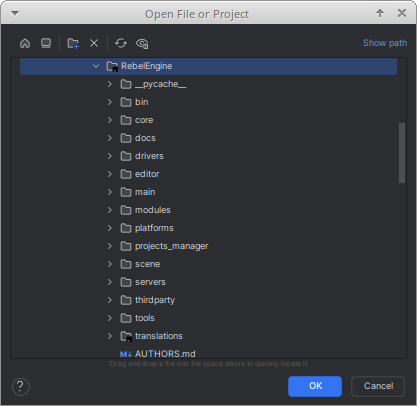
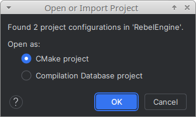
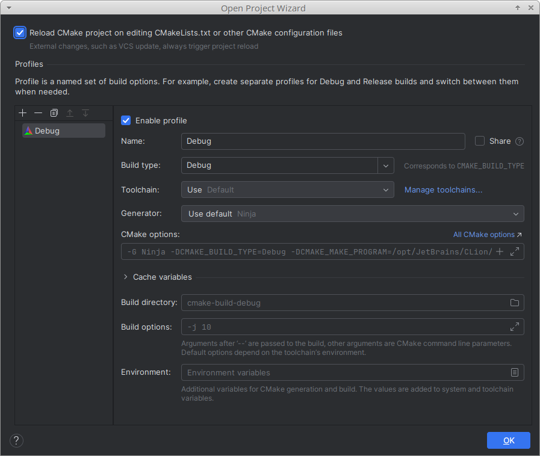
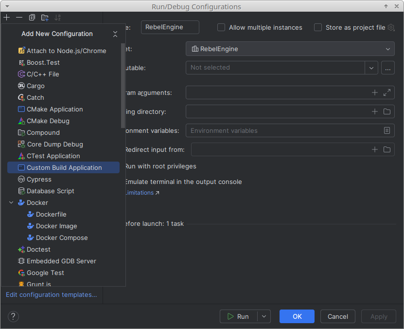
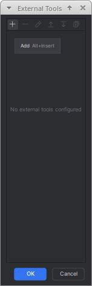
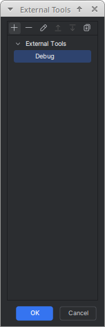
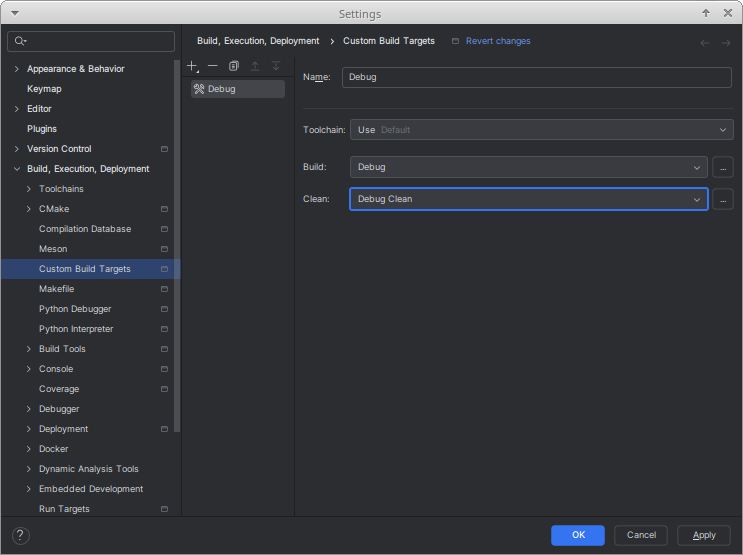
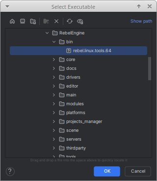

CLion
=====

`CLion <https://www.jetbrains.com/clion/>`__ is a commercial `JetBrains <https://www.jetbrains.com/>`__ IDE for C++.
However, CLion is free for non-commerical use.
As Rebel Engine is an open source project, CLion can be used for free to contribute to Rebel Engine.

Open the Rebel Engine project
-----------------------------

In the **Welcome to CLion** window,
select **Open**.

.. figure:: img/clion-welcome-to-clion.png
   :figclass: figure-w480
   :align: center

   Welcome to CLion

In the **Open File or Project** window,
browse to and select the ``RebelEngine`` root folder.

   Open the ``RebelEngine`` folder

Click **OK** to open the project.

Rebel Engine includes a Basic `CMakeLists.txt` file that CLion can use.
However, Rebel Engine does not use `CMake <https://cmake.org/>`_.
Rebel Engine is compiled using `SCons <https://scons.org/>`_.
For details on compiling Rebel Engine using SCons, see :doc:`/development/compiling/introduction_to_the_buildsystem`.

SCons will create a compilation database file that CLion can use.
If you have previously built Rebel Engine using SCons, you will have two project configurations.
CLion will prompt you to choose one.

   Choose Open as a CMake project

Although Rebel Engine doesn't use CMake, we recommend using the CMake project option.
This will enable the CLion code analysis tools.
We will configure the SCons builds manually later.
Click **OK** to open the project.

If you chose to open the CMake project, you will be presented with the **Open Project Wizard**.
We don't use CMake to build the project; so these settings won't be used.
However, it's worth selecting the **Reload CMake project on editing CMakeLists.txt or other CMake configuration files** option.

   Reload CMake project on editing CMakeLists.txt or other CMake configuration files

Click **OK**.

.. figure:: img/clion-readme.png
   :figclass: figure-w480
   :align: center

   Rebel Engine in CLion

Create a Build Configuration
----------------------------

Rebel Engine uses `SCons <https://scons.org/>`__ as the :doc:`build system </development/compiling/introduction_to_the_buildsystem>`.
We need to create the build configurations manually.
From the configurations menu, select **Edit Configurations...**.

.. figure:: img/clion-edit-configurations.png
   :figclass: figure-w480
   :align: center

   Edit Configurations...

To add a configuration, click the :kbd:`+` icon in the top-left corner.
From **Add New Configuration**, select **Custom Build Application**.

   Add a new Custom Build Application configuration

You will probably create multiple build configurations.
Name each run configuration, so you can easily identify it.

Each run configuration needs a build target.
Select **Configure Custom Build Targets**.

.. figure:: img/clion-debug-configuration.png
   :figclass: figure-w480
   :align: center

   Name Configuration and Configure Custom Build Targets

From **Add target**, select **Tool**.

.. figure:: img/clion-add-target.png
   :figclass: figure-w480
   :align: center

   Add a new Target, Tool

Name your build target.
It makes sense to give your build targets the same name as your run targets.

You will need to create a new build tool.
To the right of the **Build** drop-down list,
click the three dots: ``...``.

.. figure:: img/clion-build.png
   :figclass: figure-w480
   :align: center

   Name the Target the same as the Configuration and add a new Build tool

Click the :kbd:`+` icon in the top-left corner to add a tool.

   Add a new Tool

Name your build tool.
Again, it makes sense to give your tools the same name as your targets.

Under **Tool Settings**, **Program**, type ``scons``.
Under **Arguments** enter the arguments for this target.
For more information on the arguments available, see :doc:`/development/compiling/introduction_to_the_buildsystem`.

.. figure:: img/clion-create-tool.png
   :figclass: figure-w480
   :align: center

   Name the Build tool the same as the Target and Configuration

Click **OK** to save the build tool.

   Select your new build tool

Click **OK** to select your new build tool.

Now, create a new clean tool.
To the right of the **Clean** drop-down list, click the three dots: ``...``.

.. figure:: img/clion-clean.png
   :figclass: figure-w480
   :align: center

   Add a new Clean tool

Click the :kbd:`+` icon to add another tool.
Name your clean tool.
It makes sense to give your clean tool the same name as your build tool, but add `Clean` to the name.
Use the same arguments for the build tool, but add the ``--clean`` argument.

.. figure:: img/clion-create-clean-tool.png
   :figclass: figure-w480
   :align: center

   Name the Clean tool the same as the Build tool with **Clean**

Click **OK** to save the clean tool.

   Select the new Build and Clean tools

When you have finished creating and selecting the build and clean tools,
click **OK** to save the new build target.

.. figure:: img/clion-debug-configuration-target.png
   :figclass: figure-w480
   :align: center

   Save the new Configuration

You can now select your new target for your run configuration.
Click **OK** to save your configuration.

Run and Debug Rebel Editor
--------------------------

Once you have created a build target,
you can build your selected configuration.
If you want to run and debug a Rebel Editor build on your platform,
you will need to specify the executable created.

Although you can simply enter the location and name of the executable,
it is easiest if you build Rebel Editor first.
Once you have completed the build, you can add the executable by browsing to it.

Edit your configuration.
If you try run a configuration without specifying the executable,
you will be prompted to add an executable.

.. figure:: img/clion-debug-configuration-executable.png
   :figclass: figure-w480
   :align: center

   Specify the executable

To the right of the **Executable** drop-down list,
click the three dots: ``...``.

Browse to the `bin` folder,
and select the created executable.

   Select the created executable in the ``bin`` folder

Click **OK** to save the specified executable for your configuration.
You will now be able to run and debug the Rebel Editor build.

There are two additional configuration fields worth noting:

1. The **Program arguments** field can be used to run and debug Rebel Editor with additional program arguments.

2. If required, the **Working directory** field can be used to test specific projects. Set it to the folder containing the ``project.rebel`` file.

That's it! You're now ready to start contributing to Rebel Engine using the CLion IDE.
