KDevelop
========

`KDevelop <https://kdevelop.org/>`__ is a free, open source, cross platform IDE.

Import Rebel Engine
-------------------

From the KDevelop's welcome screen select **Open Project**.

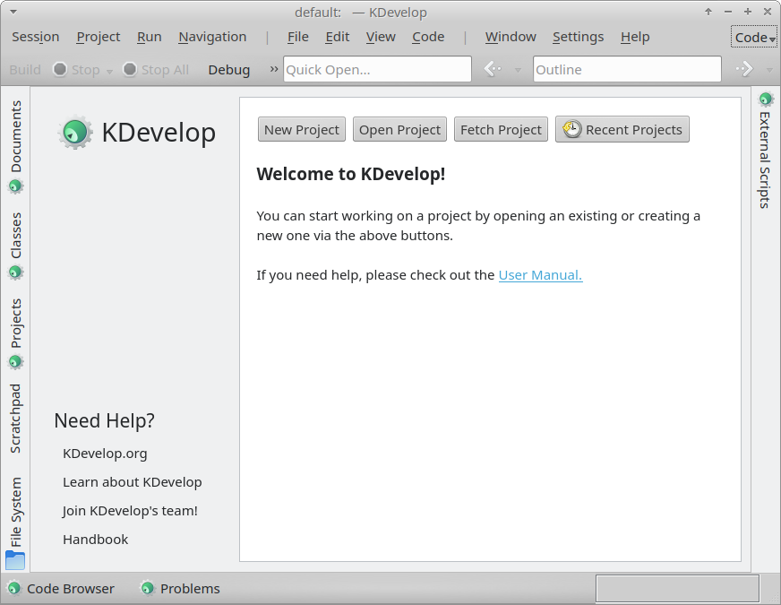

   Welcome to KDevelop

Select the Rebel Engine root folder.

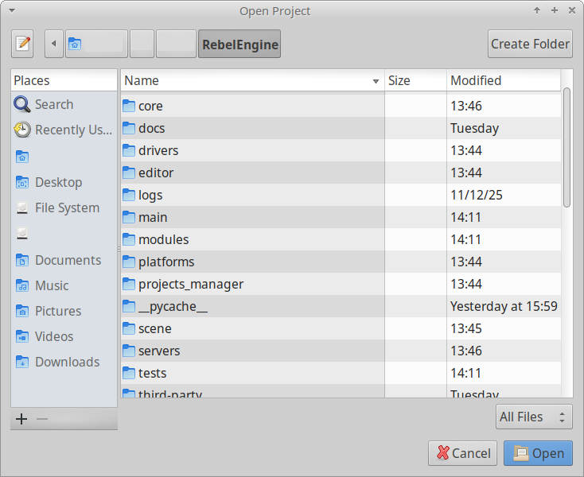

   Select ``RebelEngine`` root folder

Click **Open**.

Although, Rebel Engine includes a Basic `CMakeLists.txt` file, Rebel Engine does not use `CMake <https://cmake.org/>`_.
Rebel Engine is compiled using `SCons <https://scons.org/>`_.

Under Project Information, choose **Custom Build System** for the **Project manager**.

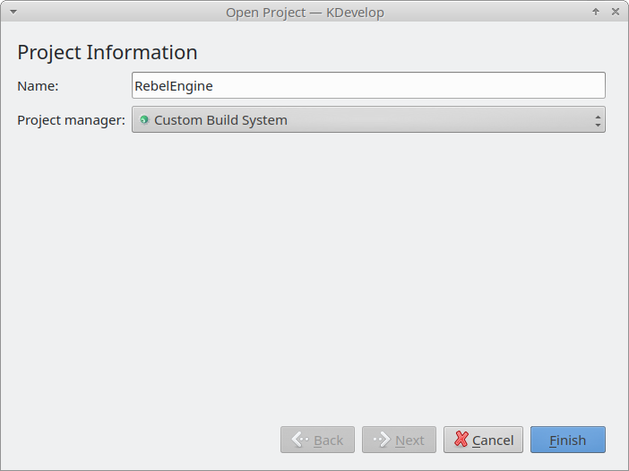

   Select **Custom Build System**

Click **Finish** and wait for KDevelop to finish importing the project.

Build Rebel Engine
------------------

From the **Project** menu, select **Open Configuration...**.

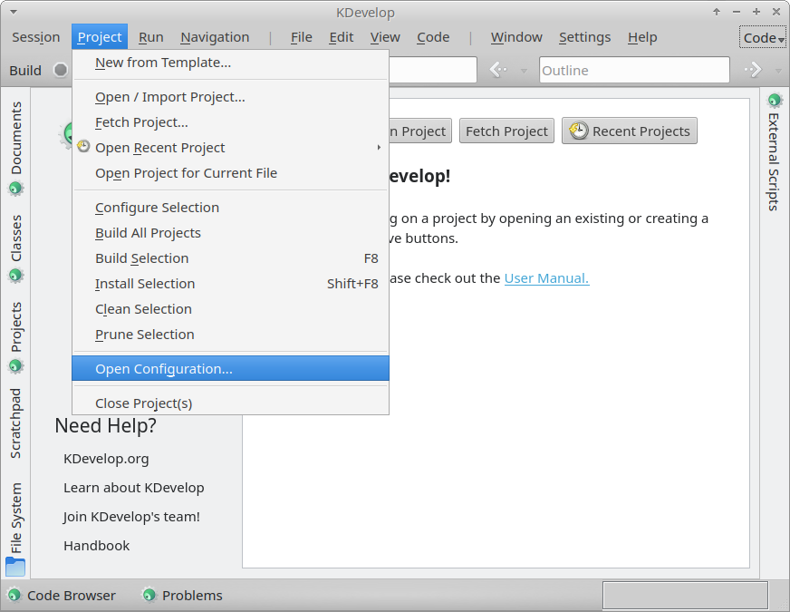

   Open the Project Configuration

Select **Custom Build System** and click **Add**.

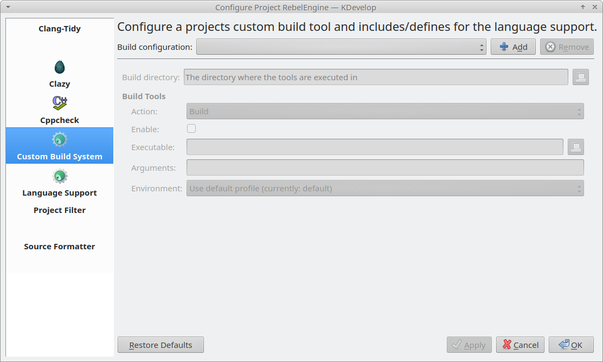

   Add Custom Build System configurations

Add your build configurations.
Rebel Engine is compiled using `SCons <https://scons.org/>`_.
For details on compiling Rebel Engine using SCons, see :doc:`/development/compiling/introduction_to_the_buildsystem`.

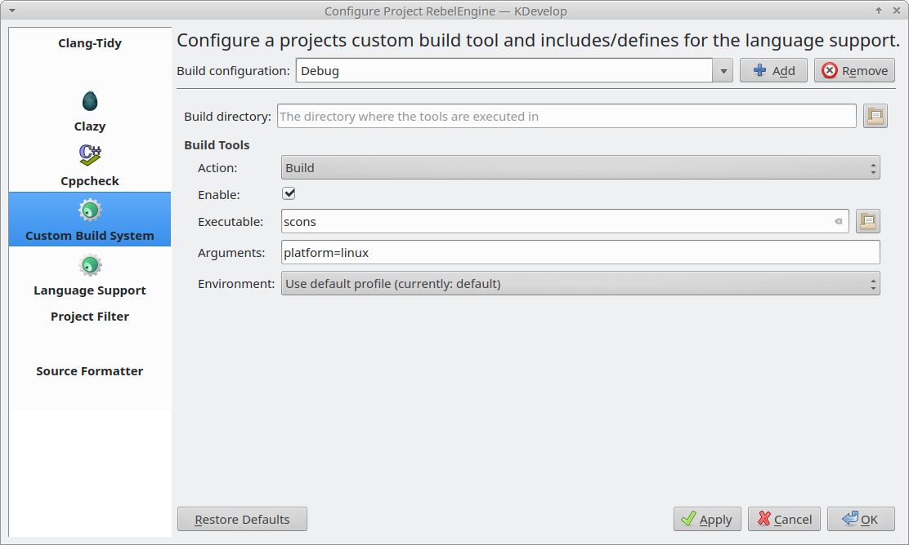

   Create your build configurations

Click **OK** to save your changes.

You can now build Rebel Engine. From the **Project** menu, select **Build Selection**, or press :kbd:`F8`.

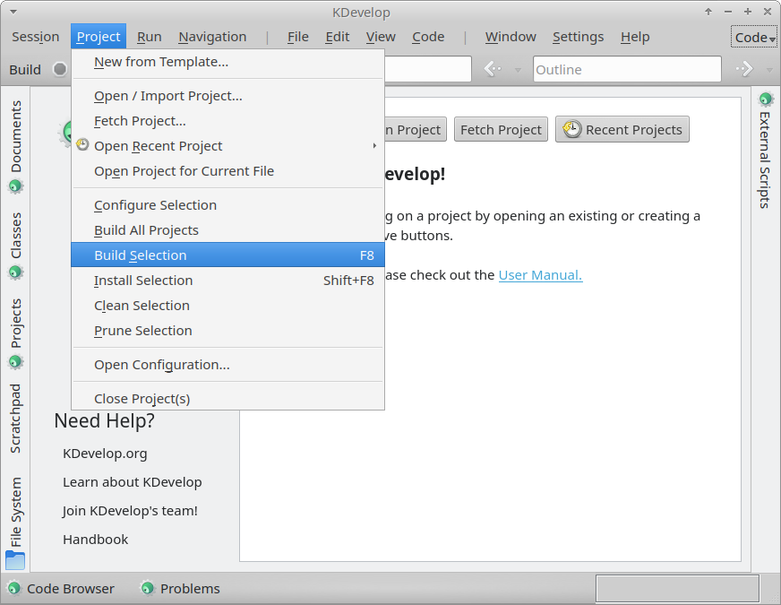

   Build Rebel Engine

Configure C++ support
---------------------

From the **Project** menu, select **Open Configuration...** again.
Select **Language Support**.

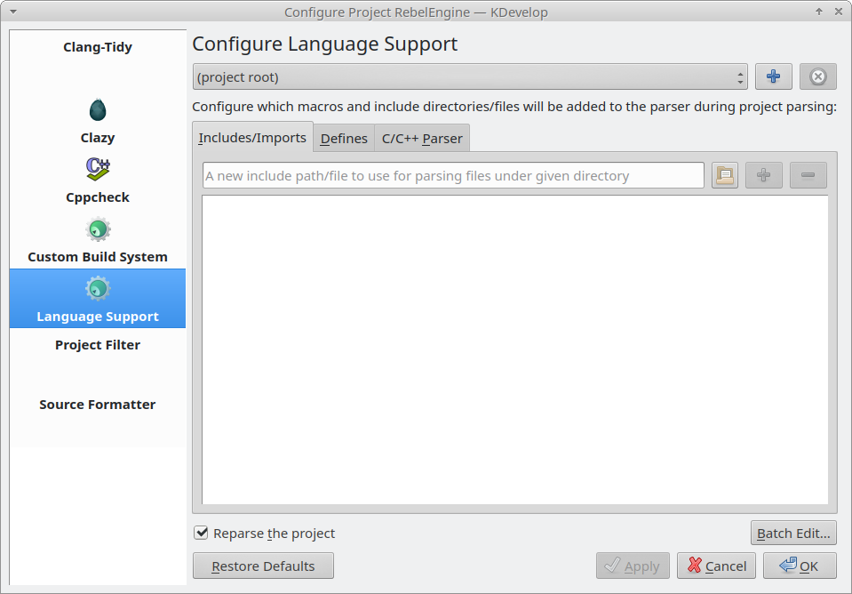

   Configure C++ Language Support

Under the **Includes/Imports** tab, type ``.``, and click the :kbd:`+` button.
This will add the project root folder, which is required for correctly parsing the includes.

Ensure **Reparse the project** is selected.
Click **OK** to save the changes.

Run and debug Rebel Engine
--------------------------

From the **Run** menu, select **Configure Launches...**.

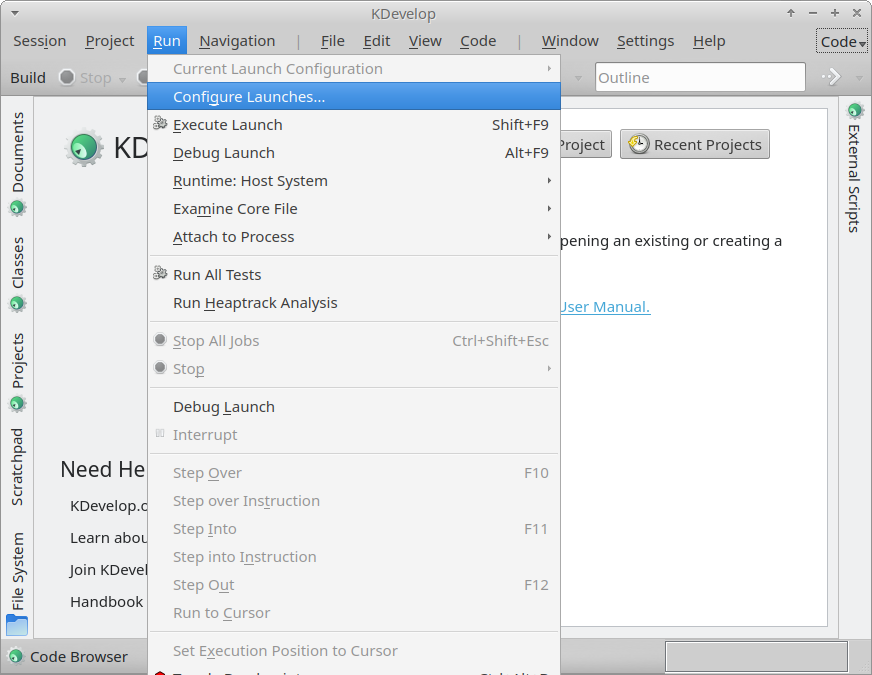

   Open the Launch Configurations

Select your ``RebelEngine`` project.

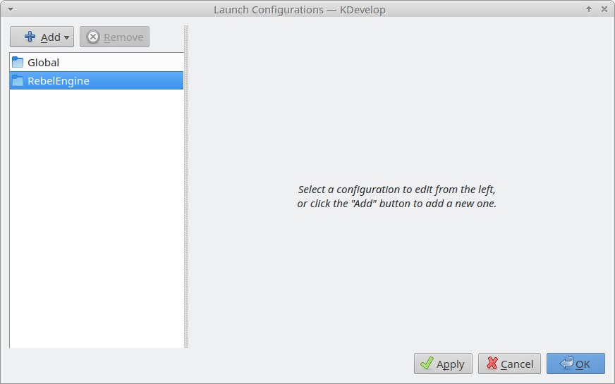

   Configure Rebel Engine Launch

Click **Add** to add a new launch configuration, and select **Compiled Binary**.

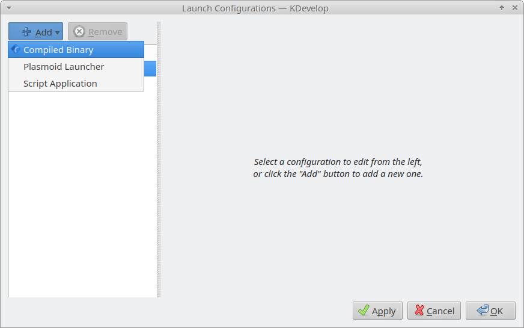

   Add Compiled Binary to Rebel Engine launch configuration

For **Executable:** browse to the ``bin`` folder and select the build file created.

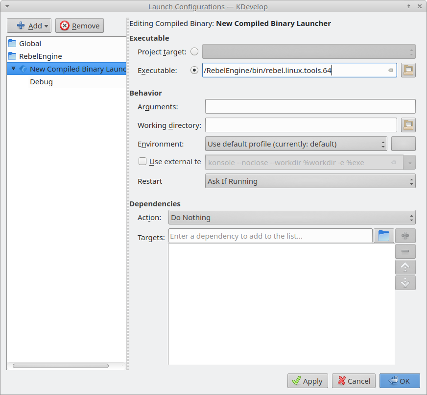

   Set **Executable** to the build file created

**Note:** To test a specific project, the **Working directory** field can be used.
Set it to the folder containing the ``project.rebel`` file.

Click **OK** to save your launch configuration.

You can now run or debug Rebel Engine.
From the **Run** menu, select **Execute Launch** (or click :kbd:`Shift+F9`) to run Rebel Engine.
Select **Debug Launch** (or click :kbd:`Alt+F9`) to debug Rebel Engine.

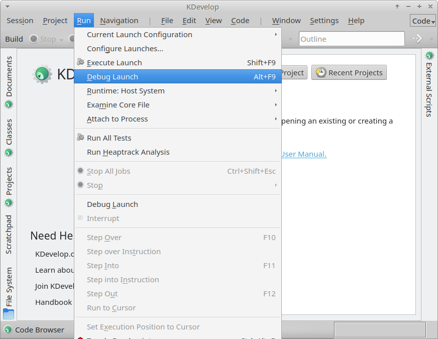

   Debug Rebel Engine

That's it! You're now ready to start contributing to Rebel Engine using KDevelop.
