Qt Creator
==========

`Qt Creator <https://doc.qt.io/qtcreator/index.html>`__ is a free, open source, cross platform IDE for developing `Qt <https://en.wikipedia.org/wiki/Qt_(software)>`__ applications.
Rebel Engine is not based on Qt, but Qt Creator can be used to develop other C++ applications like Rebel Engine.

Import Rebel Engine
-------------------

From the Qt Creator's welcome screen select **Create Project...**.

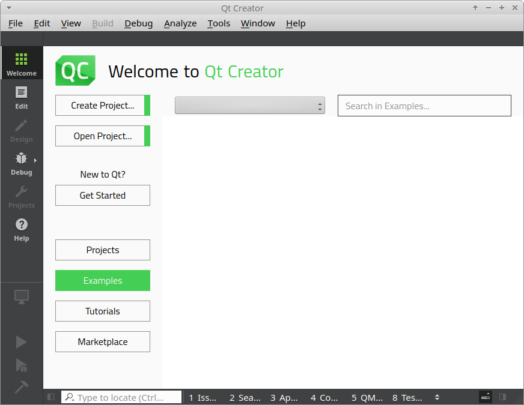

   Welcome to Qt Creator

Under **Projects**, select **Import Project** and then **Import Existing Project**.

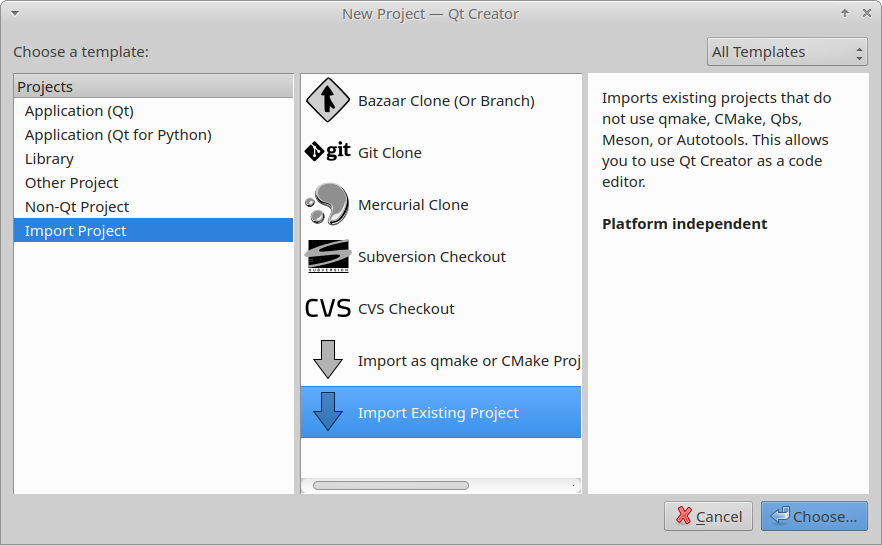

   Import Existing Project

Click **Choose...**.

Enter the project name and location.
The Project name can be anything, but it makes sense to call it ``RebelEngine``.
The Location is the root folder where you cloned RebelEngine.
You can use the Browse... button to locate the folder.

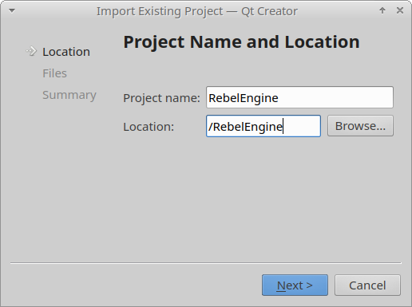

   Enter project name and location

Click **Next>** to continue.

The importer includes a set of default file types to be included.
The default file types are sufficient for most purposes.
However, if you want to add or remove file types, you can do that here or change them later.

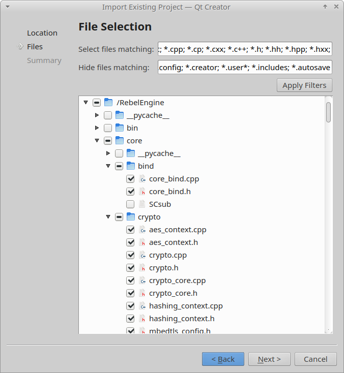

   File selection

Click **Next>** to continue.

On the summary page, we do not want to add the Qt Creator configuration files to Git.
For **Add to version control:**, select **<None>**.

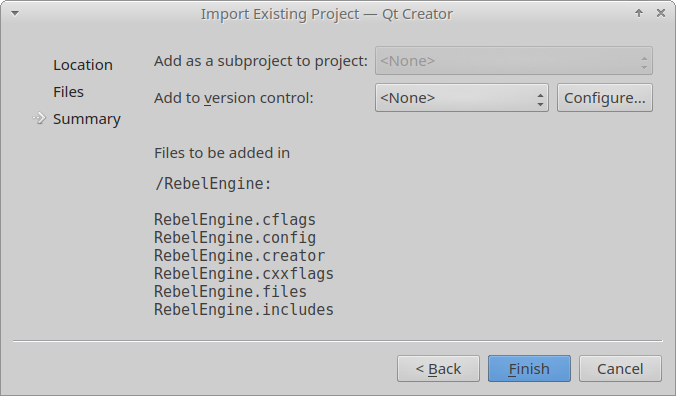

   Do not import Qt configuration files to Git

Click **Finish**.
Wait for Qt Creator to import Rebel Engine.

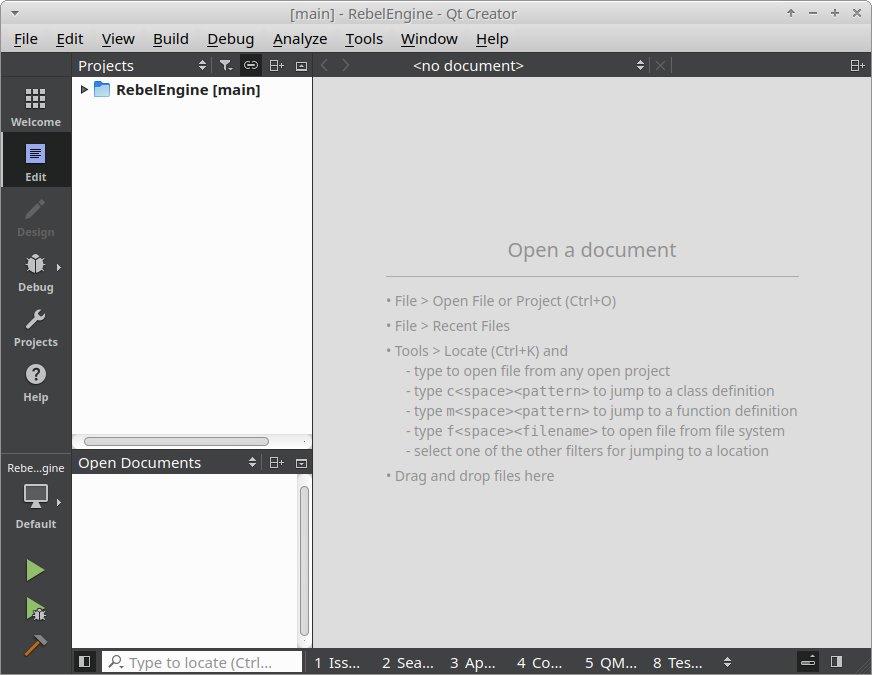

   RebelEngine in Qt Creator

As improvements are made to Rebel Engine, files and folders are added, removed and renamed.
Qt Creator does not automatically update the files and folders;
unless you are personally making the changes.
To update the project's files and folders, right-click on the RebelEngine project and select **Edit Files...**.

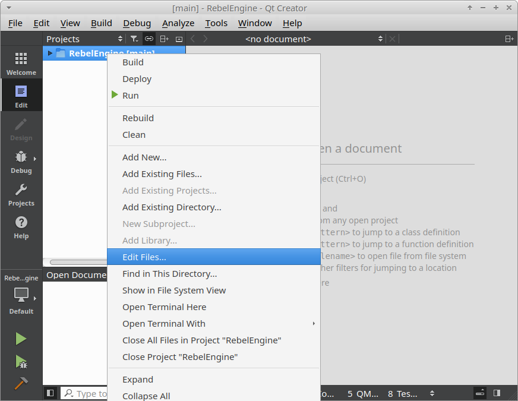

   Edit Files

If you want to add or remove file types, you can do that here too.
Useful file types to add include:

- ``*.glsl``: shader files
- ``*.py``: buildsystem files
- ``*.java``: Android platform development
- ``*.mm``: macOS platform development

   Update file selection

Click **OK** and the list of files and folders will be updated.

Configure includes
------------------

Open the ``RebelEngine.includes`` file.
Add a line containing ``.``.
This is needed for Qt Creator to find includes in the same directory as the code file.

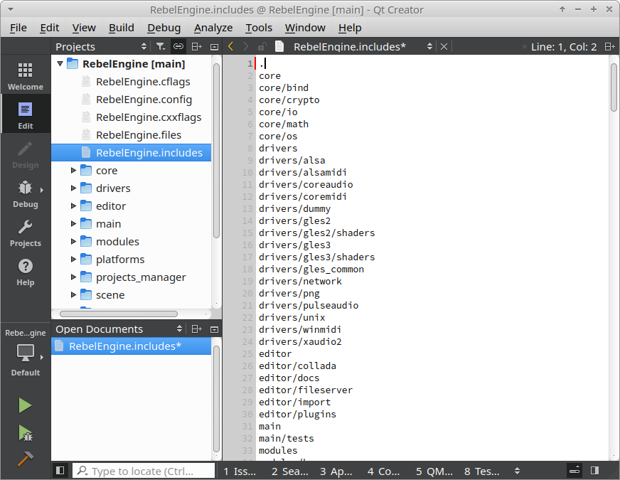

   Add ``.`` to the list of includes.

Save the file and wait for Qt Creator to update the project again.

Build Rebel Engine
------------------

On the left-hand side, select the **Projects** tab to switch to Projects mode.

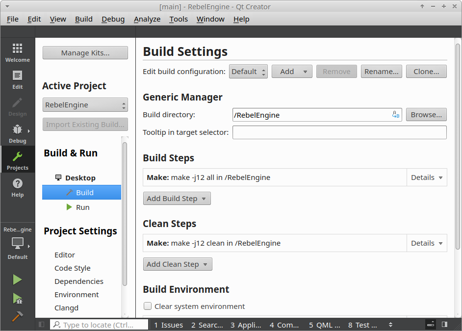

   Qt Creator Projects Mode

Here you can add your Build settings.
Rebel Engine is compiled using `SCons <https://scons.org/>`_.
For details on compiling Rebel Engine using SCons, see :doc:`/development/compiling/introduction_to_the_buildsystem`.

Under Build Steps, remove the default **Make** build step.

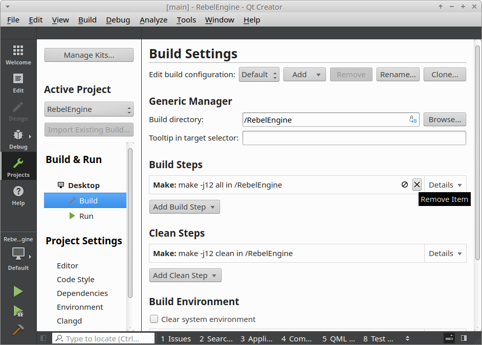

   Remove the default Make build step

Add a new custom process step.

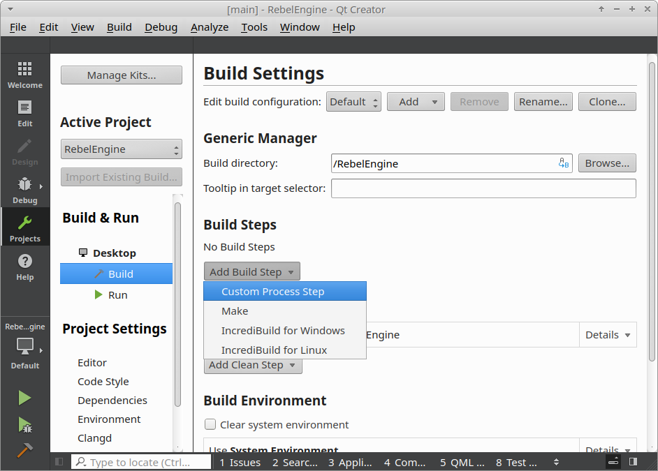

   Add a custom process step

Under **Command:** enter ``scons``.
Under **Arguments:** enter your desired build options.
Do the same thing for **Clean Steps**.
Use the same **Arguments** under **Build Steps**, but add ``--clean`` to the end.

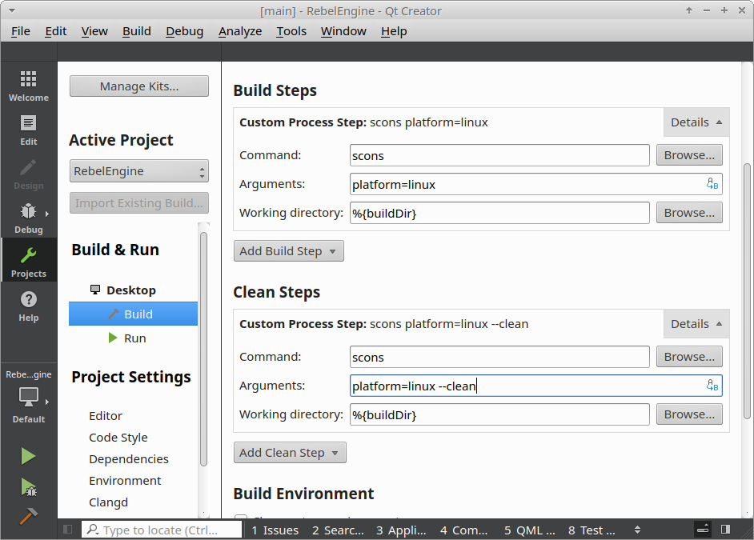

   Create the build and clean steps

In the bottom left-hand corner, click the hammer icon to build Rebel Engine.
Alternatively, from the **Build** menu, select **Build Project "RebelEngine"**, or simply :kbd:`Ctrl+B`.

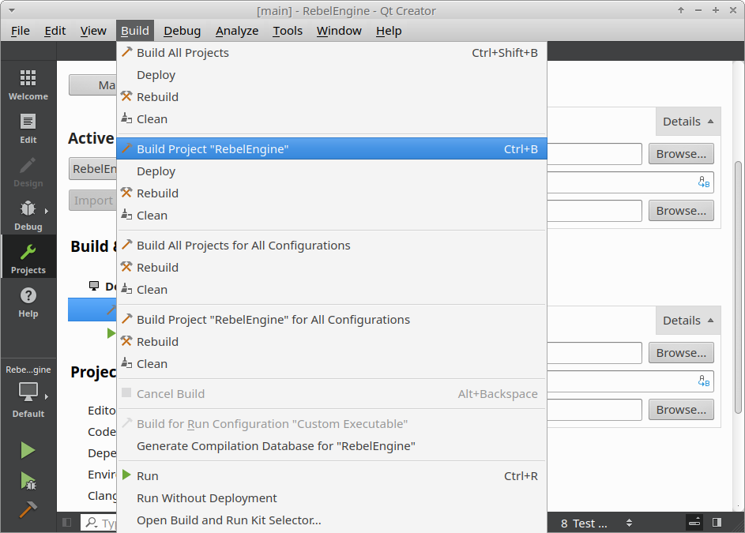

   Build Rebel Engine

Run and debug Rebel Engine
--------------------------

Once Rebel Engine has finished building, we can configure the project run settings.
Under **Build & Run**, select **Run**.
You can use the **Browse** button to select the executable created in the ``bin`` folder.

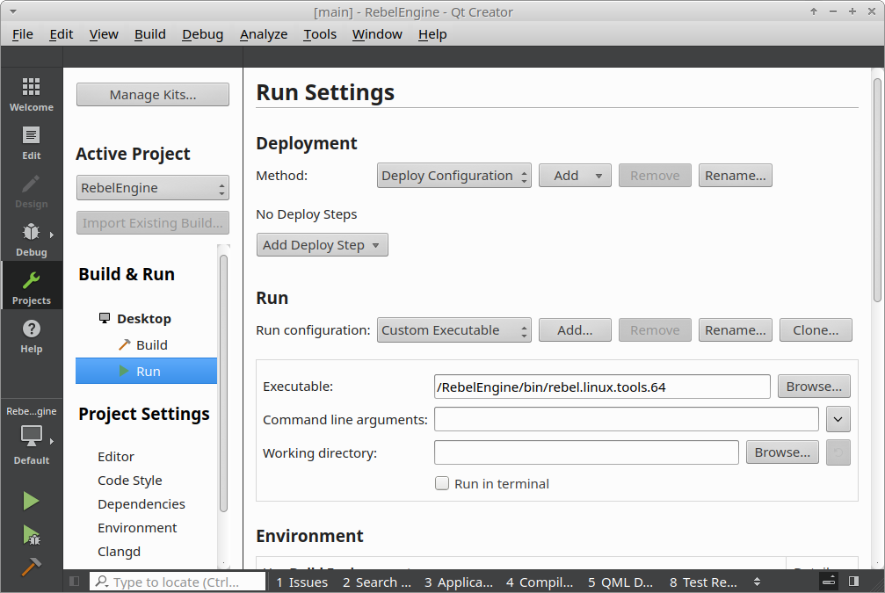

   Set Rebel Engine run executable

**Note:** To test a specific project, the **Working directory** field can be used.
Set it to the folder containing the ``project.rebel`` file.

In the bottom left-hand corner, click the green arrow to run Rebel Engine.
Click the green arrow with the bug to debug Rebel Engine.
Alternatively, from the **Build** menu, select **Run**, or simply :kbd:`Ctrl+R` to run Rebel Engine.

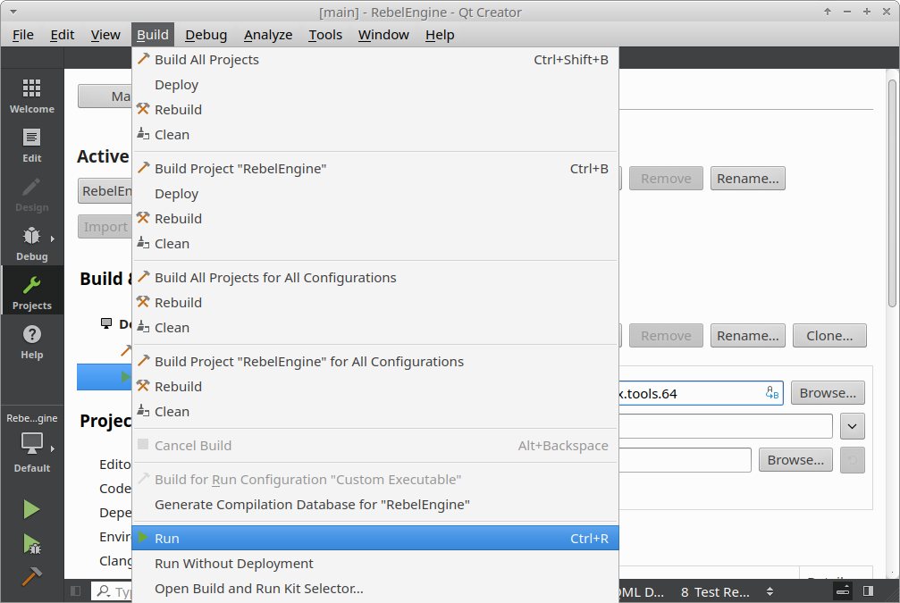

   Run Rebel Engine

That's it! You're now ready to start contributing to Rebel Engine using Qt Creator.
