Visual Studio
=============

`Visual Studio <https://visualstudio.microsoft.com>`__ is a Windows-only IDE created by Microsoft.
Visual Studio should not be confused with :doc:`visual_studio_code`.
Microsoft provides a Visual Studio Community edition that is free for open-source contributors and individuals.
As Rebel Engine is an open source project, Visual Studio can be used for free to contribute to Rebel Engine.

Install Workloads
-----------------

When running Visual Studio Installer,
include the **Desktop development with C++** workload.

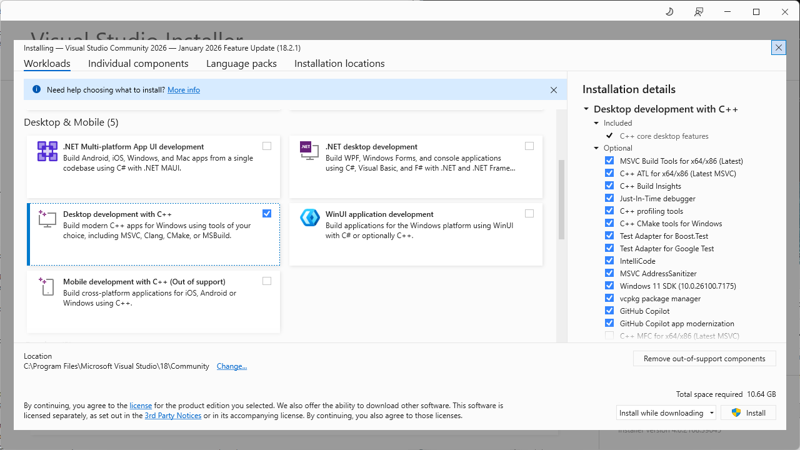

   Install Desktip development with C++

Visual Studio can also be used to do cross-platform development.
When running Visual Studio Installer,
include the **Linux, Mac, and embedded development with C++** toolset.

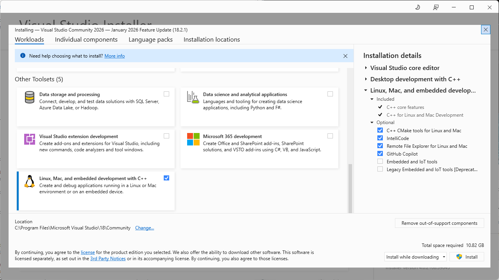

   Linux, Mac, and embedded development with C++

These can also be installed or removed later through the Visual Studio Installer application.

.. _create_a_visual_studio_project:

Create a Visual Studio project
------------------------------

Rebel Engine is compiled using `SCons <https://scons.org/>`_.
The SCons build file includes an option to create the required Visual Studio project file.
From the command line enter::

	scons -j2 vsproj=yes

The number after the ``j`` specifies the number of threads SCons should use.
The value specified here will be used to specify the number of threads to use when building Rebel Engine in Visual Studio later.
If you want to change the number of threads used by Visual Studio to build Rebel Engine,
simply re-run this command again with a new value after ``j``.

As improvements are made to Rebel Engine, files and folders are added, removed and renamed.
Visual Studio does not automatically update the files and folders; unless you are personally making the changes.
Whenever you want to update the project's files and folders, simply, re-run this command again.

.. _open_rebel_engine_solution:

Open Rebel Engine solution
--------------------------

At the Visual Studio start screen, select **Open a project or solution**.

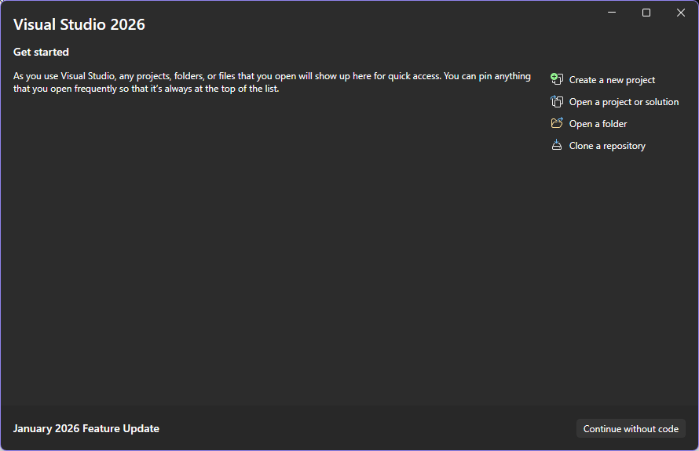

   Open a project or solution

Browse to the Rebel Engine root folder, and select the ``RebelEngine.sln``.
If you don't find the ``Rebel Engine.sln`` file in the Rebel Engine root folder,
see :ref:`create_a_visual_studio_project` for creating a Visual Studio project.

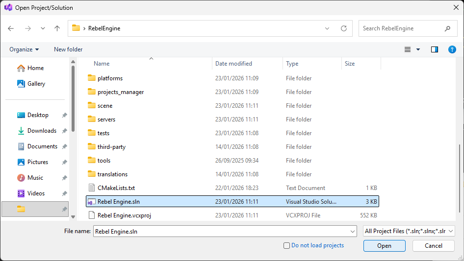

   Open ``Rebel Engine.sln``

You can now start contributing to Rebel Engine using Visual Studio
and the `Microsoft Visual Studio C and C++ compiler <https://visualstudio.microsoft.com/vs/features/cplusplus/>`__ (MSVC).

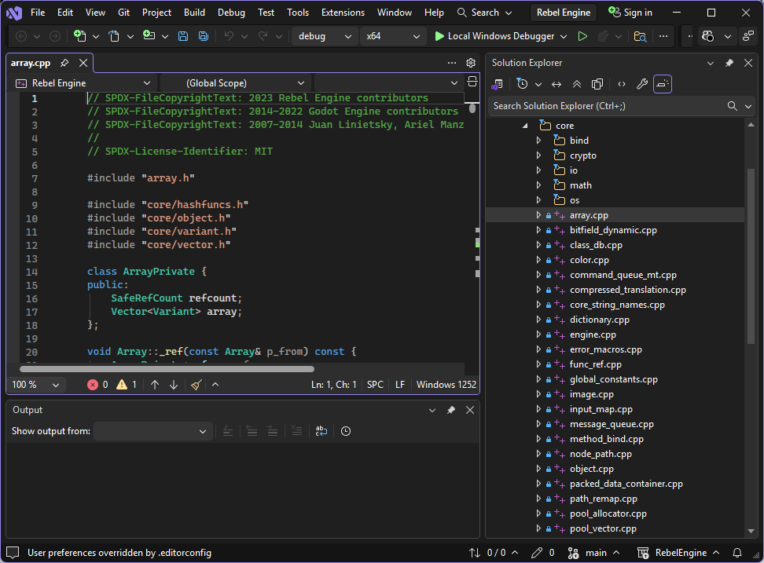

   Visual Studio Rebel Engine Solution

**Note:** The Rebel Engine solution file includes multiple configurations.
These configurations can be used to build and debug Rebel Engine in Visual Studio using MSVC,
but they can't be used to modify the build options.
To configure Visual Studio to support other build options,
we need to manually define the build configurations.
This is covered below.

.. _open_rebel_engine_folder:

Open Rebel Engine folder
------------------------

Using Visual Studio with the Rebel Engine solution file is limited to basic building and debugging.
For more advanced building and debugging we need to import Rebel Engine as a folder.
We can then define the configurations manually; including specifying the desired build options.

At the Visual Studio start screen, select **Open a folder**.

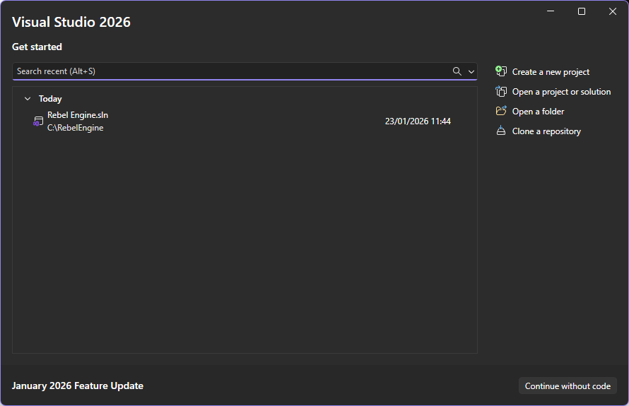

   Open a folder

Browse to and open the Rebel Engine root folder.

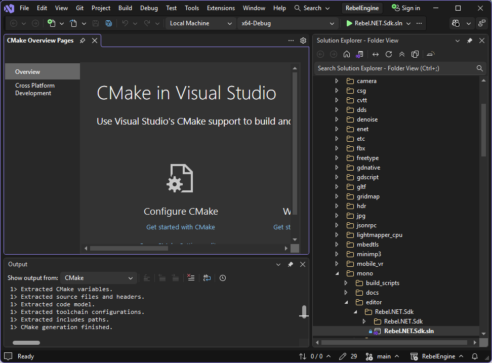

   Visual Studio Rebel Engine folder

**Note:** Rebel Engine includes a Basic ``CMakeLists.txt`` file.
Visual Studio will detect this file and assume that Rebel Engine is compiled using `CMake <https://cmake.org/>`_.
However, Rebel Engine does not use CMake.
Rebel Engine is compiled using `SCons <https://scons.org/>`_.
Visual Studio will also detect the ``Rebel.NET.Sdk.sln`` solution file.
We do not want to use this either.

.. _create_custom_rebel_enginge_build_tasks:

Create custom Rebel Engine build tasks
--------------------------------------

:ref:`open_rebel_engine_folder`.
In Solution Explorer, right-click on any folder or file and select **Configure Tasks**.

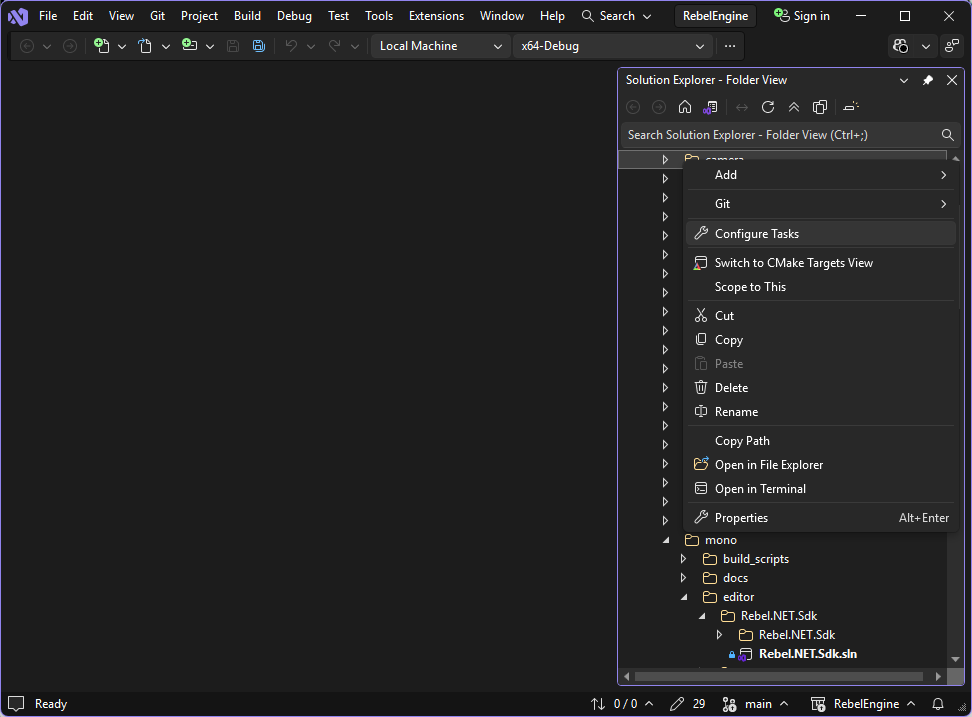

   Right-click on a file or folder and select **Configure Tasks**

This will create a ``tasks.vs.json`` file in the ``.vs`` folder.
Here you can create your build tasks.
For each task, define the following task fields:

- **taskLabel**: This can be anything that helps you identify the build variant.
- **appliesTo**: ``"**/*"``
- **contextType**: ``custom``
- **type**: ``launch``
- **command**: ``scons``
- **args**: An array containing the build arguments.

You can create as many build tasks as desired.
For details on Rebel Engine build options using SCons, see :doc:`/development/compiling/introduction_to_the_buildsystem`.
For more information on the ``tasks.vs.json`` schema, see https://learn.microsoft.com/en-us/cpp/build/tasks-vs-json-schema-reference-cpp.

Save the ``tasks.vs.json`` file.
Now, when you right-click on any file or folder in the Solution Explorer,
your tasks will be listed as **Run** options under **Configure Tasks**.

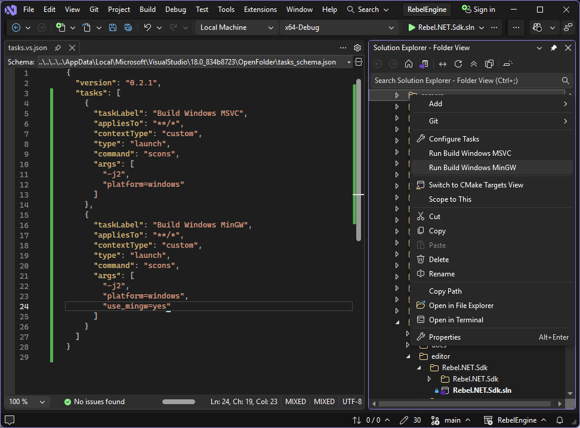

   Create and run build tasks

You can now build Rebel Engine with any of the build options.

Run and debug Rebel Engine
--------------------------

If you're using the :ref:`Rebel Engine solution <open_rebel_engine_solution>` file, run and debug configurations will be pre-configured.
Run and debug Rebel Engine like any other Visual Studio project.

If you're using the :ref:`Rebel Engine folder <open_rebel_engine_folder>`,
you need to find the executable created by your :ref:`custom build task <create_custom_rebel_enginge_build_tasks>`.
By default, Solution Explorer doesn't show all files; so click the **Show All Files** icon.

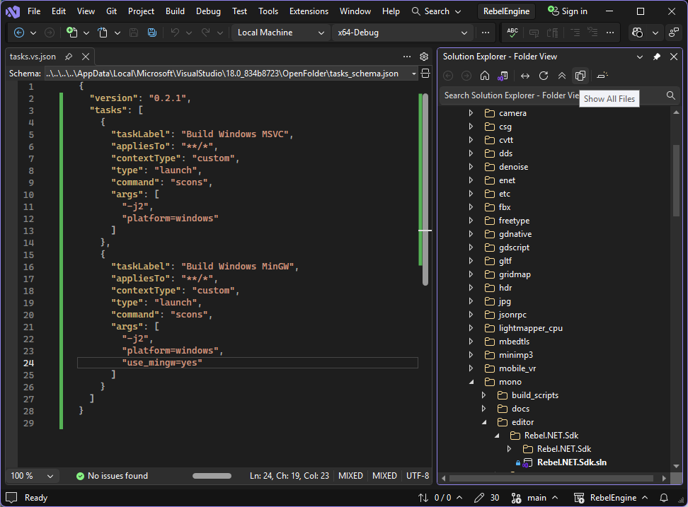

   Show all files

Browse to the Rebel Engine ``bin`` folder, and find the executable that your custom build task created.

If you used the default `MSVC <https://visualstudio.microsoft.com/vs/features/cplusplus/>`__ compiler,
the executable will have the ``msvc.exe`` suffix.
Simply, right-click on the executable, and select **Debug**.
This will start the Visual Studio debugger.
For more information on the Visual Studio debugger, see https://learn.microsoft.com/en-us/visualstudio/debugger/debugger-feature-tour.

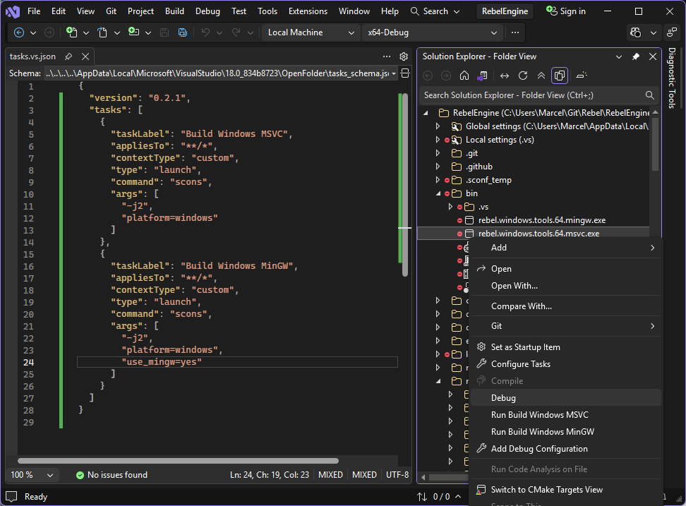

   Show all files

If you used a different compiler, you need to create a custom launch debug configuration.
For example, if you used the ``use_mingw=yes`` build option,
Rebel Engine will be built with the `GCC Compiler <https://gcc.gnu.org/>`_,
and the executable will have the ``mingw.exe`` suffix.
Right-click on the executable and select **Add Debug Configuration**.

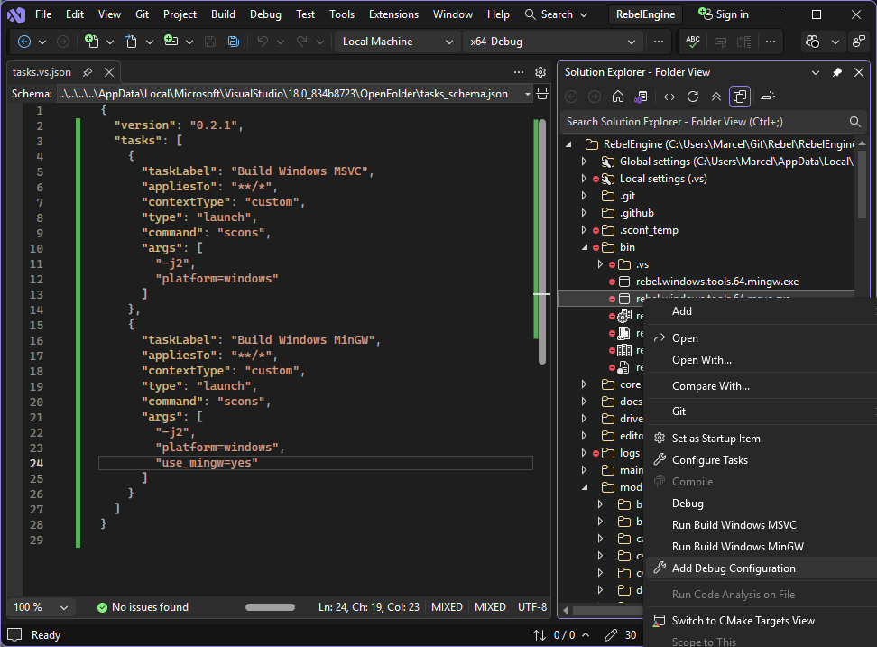

   Add Debug Configuration

The required debugger depends on the compiler used to build Rebel Engine.
For example, if you used the ``use_mingw=yes`` build option,
the created executable can be debugged with the `GDB <https://www.sourceware.org/gdb/>`__ debugger.

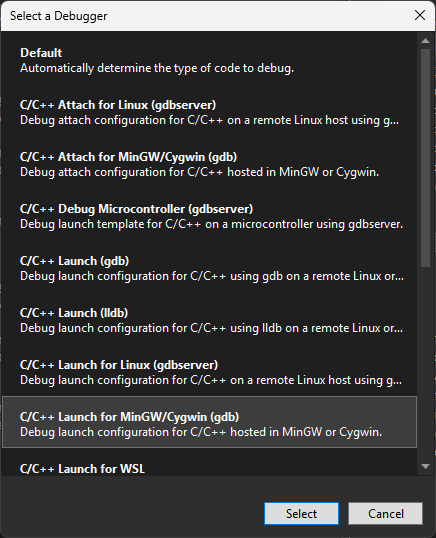

   Create Debug launch configuration

**Note:** Visual Studio can also be used to cross-compile for Linux using a remote Linux environment,
or the `Windows Subsystem for Linux <https://learn.microsoft.com/en-us/windows/wsl/>`_.
There are options to create debugger launch configurations for these builds too.
For more information, see `Linux development with C++ <https://learn.microsoft.com/en-gb/cpp/linux/>`_.

Select your required debugger, and click **Select**.
This will create a ``launch.vs.json`` file in the ``.vs`` folder.

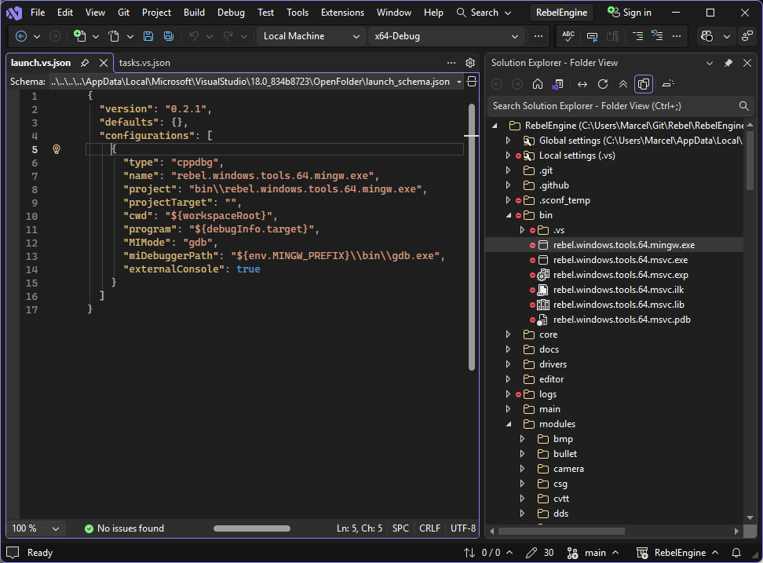

   ``launch.vs.json``

If you selected the correct debugger for the executable, there should be no need to change anything.
For more information on the ``launch.vs.json`` schema, see https://learn.microsoft.com/en-us/cpp/build/launch-vs-schema-reference-cpp

You should now be able to right-click on the ``mingw.exe`` executable and select **Debug** to run and debug Rebel Engine.

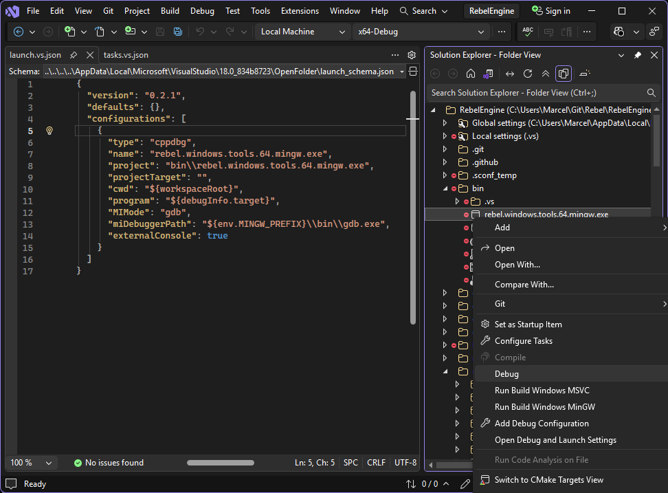

   Debug MinGW Rebel Engine

**Note:** If the ``MINGW_PREFIX`` environmental variable is not defined,
Visual Studio will not find your GDB executable.

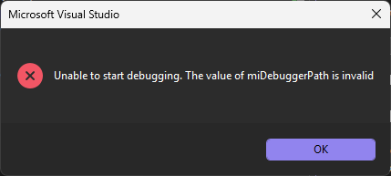

   Unable to start debugging

Visual Studio will be unable to start debugging if the value of ``miDebuggerPath`` is invalid.

If GDB is in your path, you can simply remove the ``${env.MINGW_PREFIX}\\bin\\`` from the ``miDebuggerPath`` variable.
Alternatively, you can define the ``MINGW_PREFIX`` environment variable in a project configuration file.

Create a project configuration file
-----------------------------------

If one doesn't exist, create a ``CppProperties.json`` file in the Rebel Engine root folder.
Here you can store one or more project configurations.
For each configuration, define the following fields:

- **name**: The name you want to appear in the configuration drop down list.
- **intelliSenseMode**: Select the desired architecture-specific variant.
- **includePath**: An array of include paths. Add ``.`` to support code lookups.
- **environments**: An array of variables that can be accessed with ``${env.VARIABLE}``.

For more information on the ``CppProperties.json`` schema, see https://learn.microsoft.com/en-us/cpp/build/cppproperties-schema-reference

For example, add the ``MINGW_PREFIX`` environment variable to the **environments** array.
Set the value to the root folder of your MinGW-64 installation.
GDB should be in the ``bin`` folder of this path.
Also, remember to use a double ``\\`` for each ``\`` in the path.

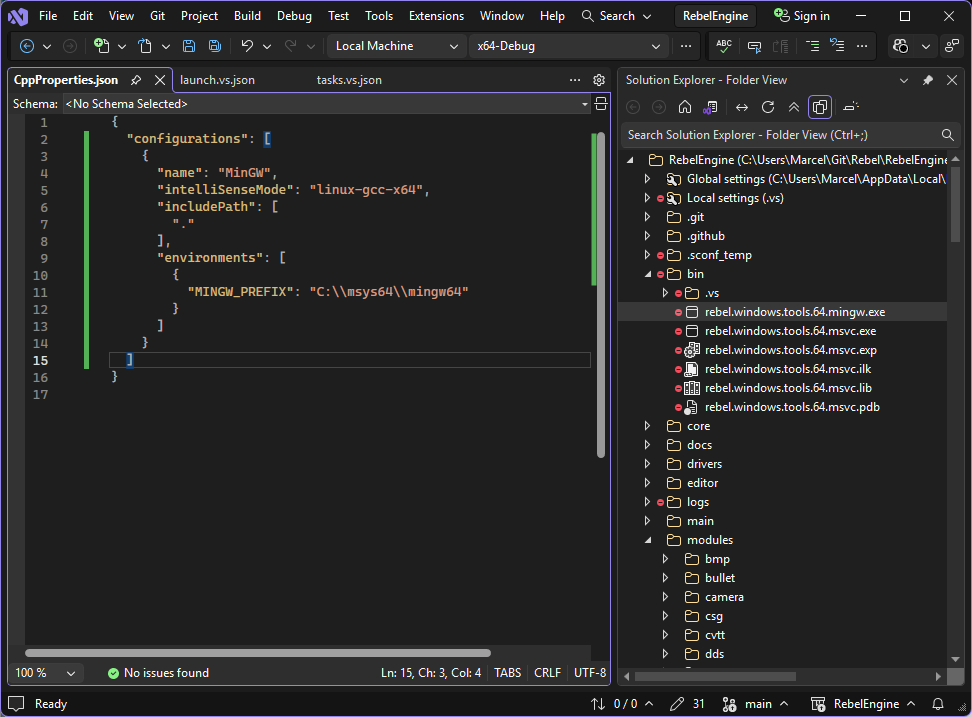

   ``CppProperties.json``

In the configuration drop down list, select your new configuration.

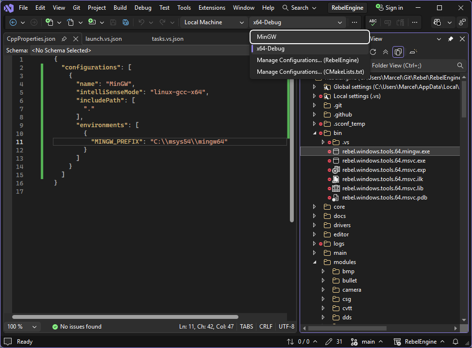

   Select configuration

Finally, we need to tell our launch configuration to inherit the active configuration environment.
In the ``launch.vs.json`` file, add the ``inheritEnvironments`` field to the configuration.
The ``inheritEnvironments`` field is an array of values.
Add the value ``${cpp.activeConfiguration}``.

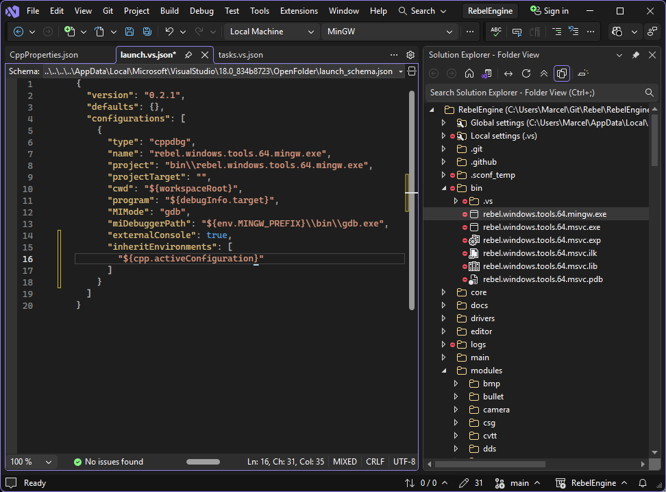

   Select configuration

You should now be able to right-click on the ``mingw.exe`` executable and select **Debug** to run and debug Rebel Engine.

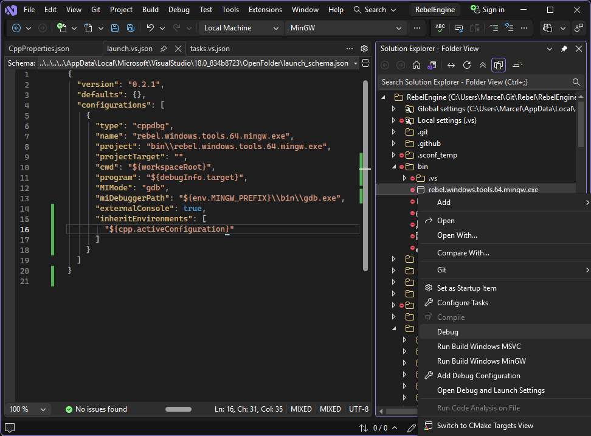

   Debug MinGW Rebel Engine

That's it! You're now ready to start contributing to Rebel Engine using Visual Studio.
