Visual Studio Code
==================

`Visual Studio Code <https://code.visualstudio.com>`__ (also known as "VS Code"), is a cross platform IDE created by Microsoft.
Visual Studio Code should not be confused with :doc:`visual_studio`.
Visual Studio Code is proprietary software released under the "Microsoft Software License".
However, it is based on the MIT licensed program named `Visual Studio Code – Open Source <https://github.com/microsoft/vscode>`__ (also known as "Code – OSS").

Ensure you have configured VS Code for C++.
For more information, see the Visual Studio Code guides for configuring VS Code for C++:
https://code.visualstudio.com/docs/cpp/introvideos-cpp

Importing Rebel Engine
----------------------

From the **File** menu, select **Open Folder...**.

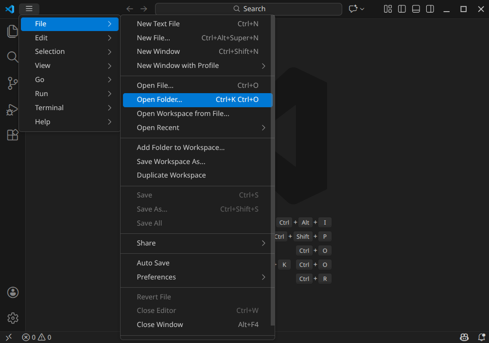

   File, Open folder

Browse to and open the Rebel Engine root folder.

When prompted, select **Yes, I trust the authors**.

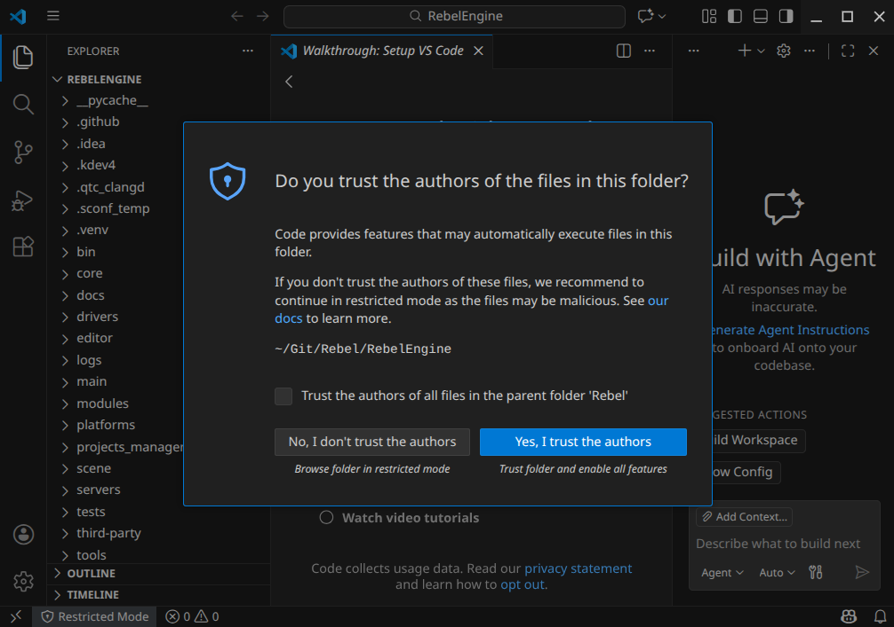

   Trust the authors

Configure Build Tasks
---------------------

From the Visual Studio Code's main screen, press :kbd:`Ctrl+Shift+P` to open the command prompt window.
Type ``configure task``, and select **Tasks: Configure Task**.

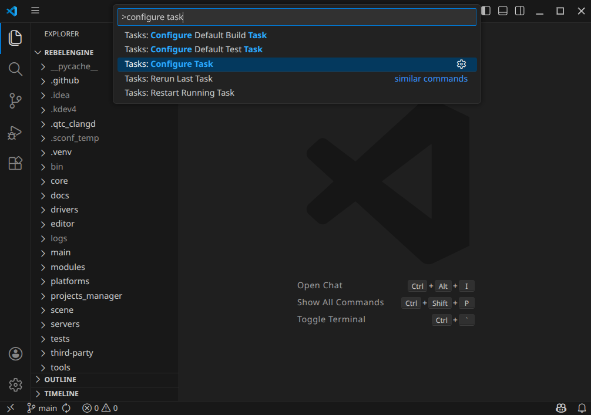

   Tasks: Configure Task

Select **Create tasks.json file from template** option.

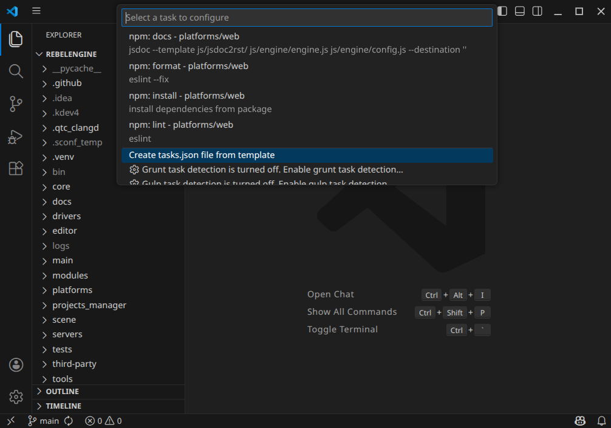

   Create tasks.json file from template

Select "**Others** Example to run an arbitrary external command" task template.

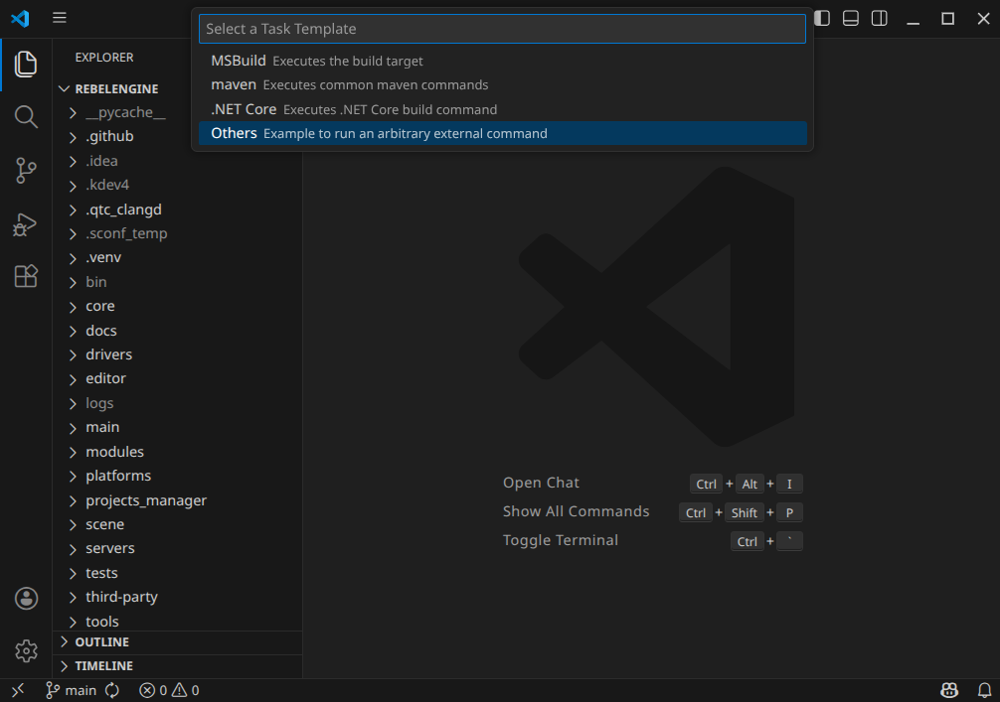

   Select **Others** task template

Here we create our build tasks.
For each build variant, we need to define the following:

- **label**: This can be anything that helps you identify the build variant.
- **group**: ``build``
- **type**: ``shell``.
- **command**: ``scons``
- **args**: An array containing the build arguments.
- **problemMatcher**: ``$gcc``

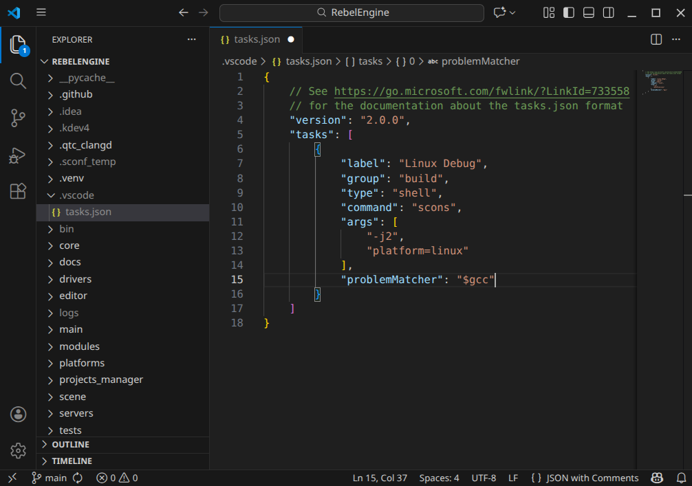

   Create a SCons build task

For more information on using `SCons <https://scons.org/>`_. and the build options used to compile Rebel Engine, see :doc:`/development/compiling/introduction_to_the_buildsystem`.

For more information on the ``tasks.json`` format, see https://go.microsoft.com/fwlink/?LinkId=733558

You can now build Rebel Engine.
Press :kbd:`Ctrl+Shift+B`, and select your build task.

Run and Debug Rebel Engine
--------------------------

Create a ``launch.json`` file.
On the left-hand side, **Run and Debug** icon (the triangle with the bug) or press :kbd:`Ctrl+Shift+D`.

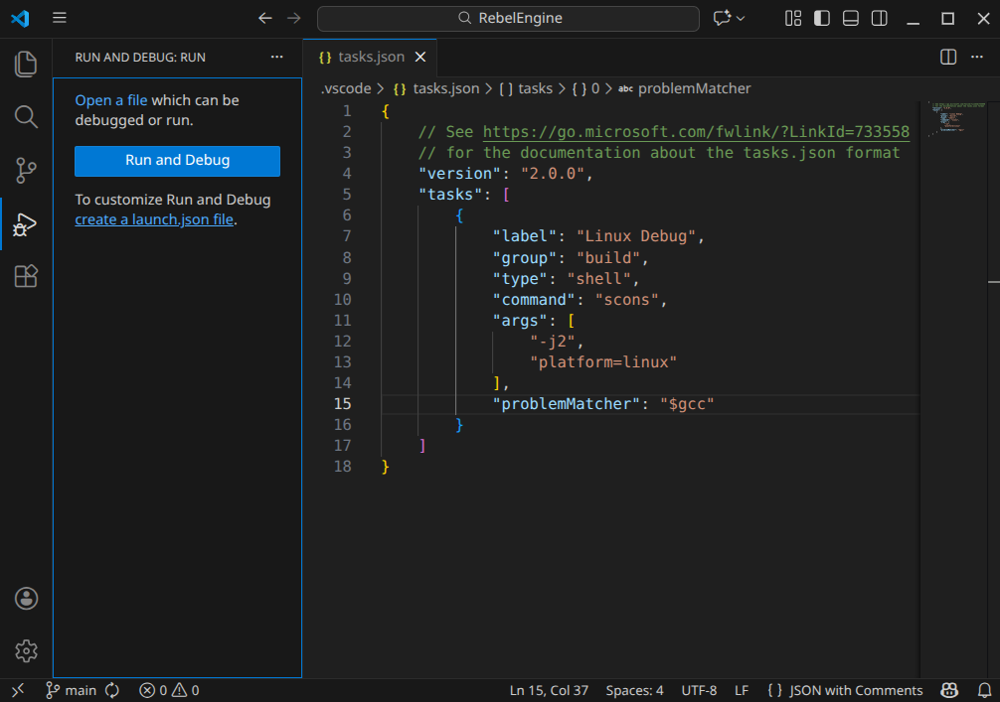

   Create a ``launch.json`` file

Click **create a launch.json file**.

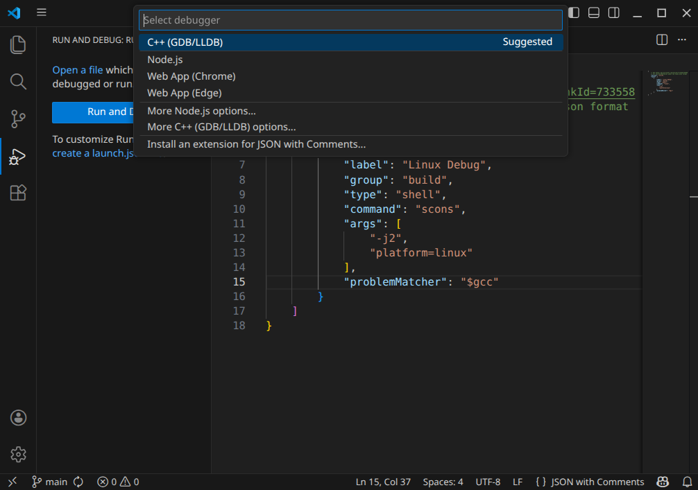

   Select **C++ (GDB/LLDB)**

Select the suggested **C++ (GDB/LLDB)** debugger.

Add a **{} C/C++: (gdb) Launch** configuration.
If necessary, use the **Add Configuration...** button to get the template prompt.

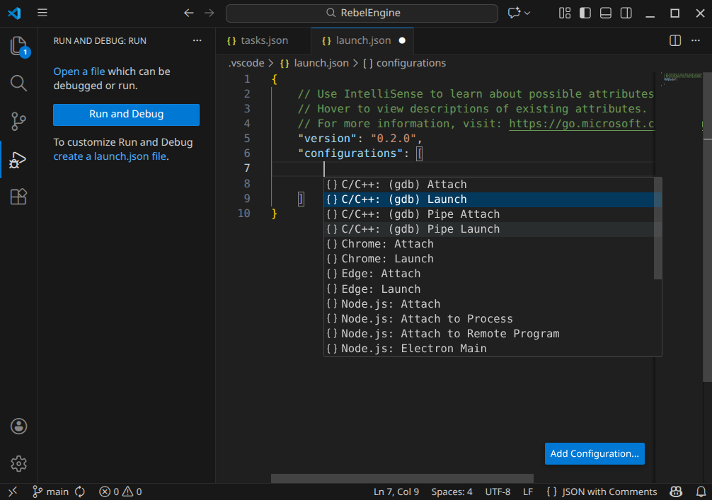

   Add **{} C/C++: (gdb) Launch** configuration

By using the right template, most of the fields are completed for us.
However, we need to specify the **program** field.
This needs to be the name of the Rebel Engine executable in the ``bin`` folder that was created by the build task.
For example ``${workspaceFolder}/bin/rebel.linux.tools.64``.

We also want to ensure the build is updated before launching the debugger.
Add the field **preLaunchTask**, and set it to the name of your build task.

It is also useful to set the launch configuration **name**.
Use a name that ties the launch configuration to the build task.

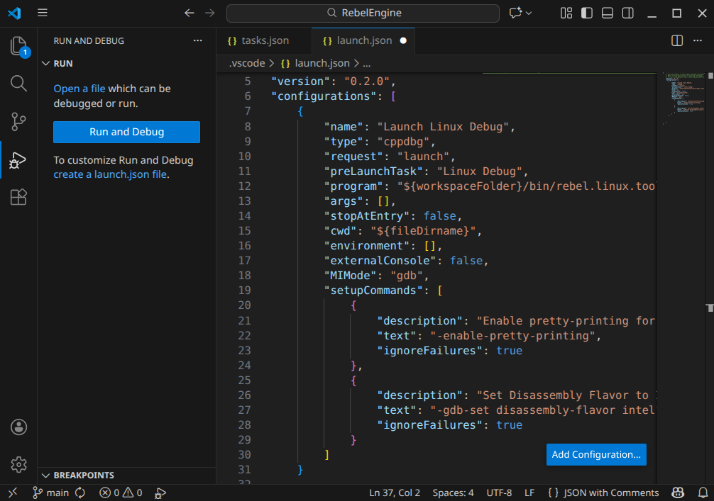

   Specify the launch configuration

For more information on launch configurations, see https://code.visualstudio.com/docs/debugtest/debugging-configuration

Save the changes.
You can now run and debug Rebel Engine.
Click the green, right-pointing triangle or press :kbd:`F5`.

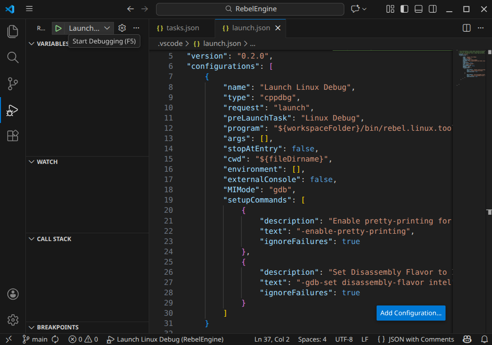

   Launch and Debug Rebel Engine

That's it! You're now ready to start contributing to Rebel Engine using Visual Studio Code.
