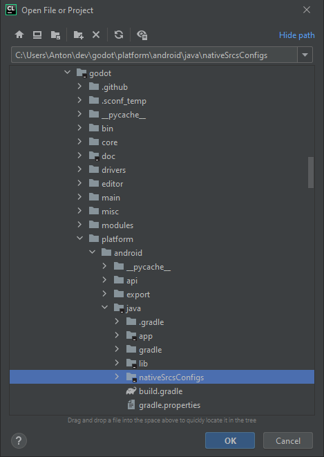
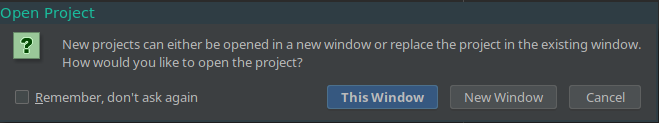
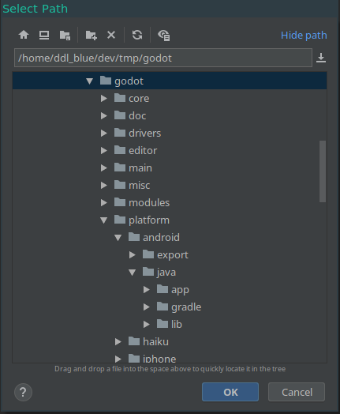
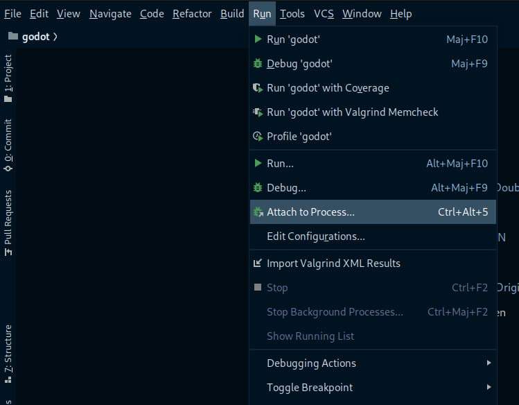
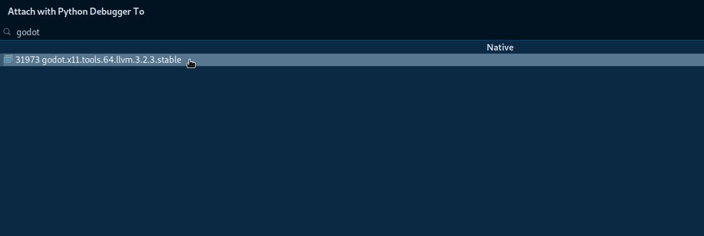

CLion
=====

`CLion <https://www.jetbrains.com/clion/>`_ is a commercial
`JetBrains <https://www.jetbrains.com/>`_ IDE for C++.

Importing the project
---------------------

CLion requires a ``CMakeLists.txt`` file as a project file, which is problematic
for Rebel Engine because it uses the SCons buildsystem instead of CMake. However,
there is a ``CMakeLists.txt`` configuration for :doc:`Android Studio </development/cpp/configuring_an_ide/android_studio>`
which can also be used by CLion.

- From the CLion's welcome window choose the option to import an existing
  project. If you've already opened another project, choose **File > Open**
  from the top menu.
- Navigate to ``RebelEngine/platform/android/java/nativeSrcsConfigs`` (the
  ``CMakeLists.txt`` file is located there) and select it (but *not* the
  ``CMakeLists.txt`` file itself), then click **OK**.

   The folder containing the ``CMakeLists.txt`` file.

- If this popup window appears, select **This Window** to open the project:

- Choose **Tools > CMake > Change Project Root** from the top menu and select
  the Rebel Engine root folder.

- You should be now be able to see all the project files. Autocomplete should
  work once the project has finished indexing.

Debugging the project
---------------------

Since CLion does not support SCons, you won't be able to compile, launch, and debug Rebel Engine from CLion in one step.
You will first need to :doc:`/development/compiling/index` and run the binary without CLion. You will then be able to debug Rebel Engine by using the `Attach to process <https://www.jetbrains.com/help/clion/attaching-to-local-process.html>`__ feature.

- Run the compilation in debug mode by entering ``scons``.

- Run the binary you have created (in the bin directory). If you want to debug a specific project, run the binary with the following arguments : ``--editor --path path/to/your/rebel/project``. To run the project instead of editing it, remove the ``--editor`` argument.

- In CLion, go to **Run > Attach to Process...**

- Find and Select Rebel Engine in the list (or type the binary name/Process ID)

You can now use the debugging tools from CLion.

.. note::

    If you run the binary without any arguments, you will only debug the project manager window.
    Don't forget to add the ``--path path/to/your/rebel/project`` argument to debug a project.
