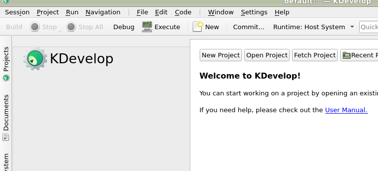
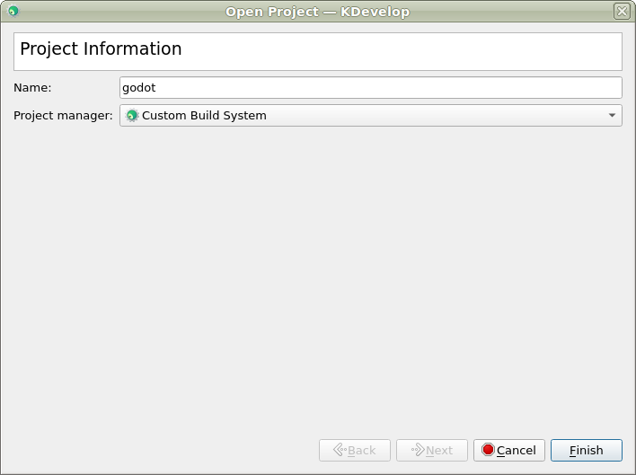

KDevelop
========

`KDevelop <https://kdevelop.org/>`_ is a free, open source IDE for all desktop platforms.

Importing the project
---------------------

- From the KDevelop's main screen select **Open Project**.

   KDevelop's main screen.

- Navigate to the Rebel Engine root folder and select it.
- On the next screen, choose **Custom Build System** for the **Project Manager**.

- After the project has been imported, open the project configuration by right-clicking 
  on it in the **Projects** panel and selecting **Open Configuration..** option.

.. figure:: img/kdevelop_openconfig.png
   :figclass: figure-w480
   :align: center

- Under **Language Support** open the **Includes/Imports** tab and add the following paths:

  .. code-block:: none

     .  // A dot, to indicate the root of the Rebel Engine project
     core/
     core/os/
     core/math/
     drivers/
     platforms/<your_platform>/  // Replace <your_platform> with a folder 
                                   corresponding to your current platform

.. figure:: img/kdevelop_addincludes.png
   :figclass: figure-w480
   :align: center

- Apply the changes.
- Under **Custom Build System** add a new build configuration with the following settings:

  +-----------------+-------------------------------------------------------------------------------------------------+
  | Build Directory | *blank*                                                                                         |
  +-----------------+-------------------------------------------------------------------------------------------------+
  | Enable          | **True**                                                                                        |
  +-----------------+-------------------------------------------------------------------------------------------------+
  | Executable      | **scons**                                                                                       |
  +-----------------+-------------------------------------------------------------------------------------------------+
  | Arguments       | See :doc:`/development/compiling/introduction_to_the_buildsystem` for a full list of arguments. |
  +-----------------+-------------------------------------------------------------------------------------------------+

- Apply the changes and close the configuration window.

Debugging the project
---------------------

- Select **Run > Configure Launches...** from the top menu.

.. figure:: img/kdevelop_configlaunches.png
   :figclass: figure-w480
   :align: center

- Click **Add** to create a new launch configuration.
- Select **Executable** option and specify the path to your executable located in 
  the ``RebelEngine/bin`` folder. The name depends on your build configuration,
  e.g. ``rebel.x11.tools.64`` for 64-bit X11 platform with ``tools`` enabled.

.. figure:: img/kdevelop_configlaunches2.png
   :figclass: figure-w480
   :align: center
