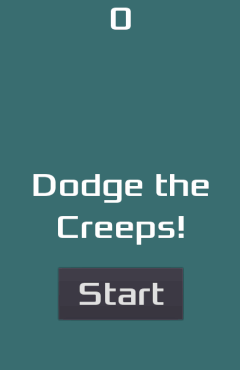

.. _doc_your_first_2d_game:

Your first 2D game
==================

In this step-by-step tutorial series, you will create your first complete 2D
game with Rebel Editor. By the end of the series, you will have a simple yet complete
game of your own, like the image below.

|image0|

You will learn how the Rebel Editor works, how to structure a project, and build
a 2D game.

.. note:: This project is an introduction to the Rebel Editor. It assumes that
          you have some programming experience already. If you're new to
          programming entirely, you should start here: :doc:`/getting_started/step_by_step/scripting_languages`.

The game is called "Dodge the Creeps!". Your character must move and avoid the
enemies for as long as possible. 

You will learn to:

- Create a complete 2D game with the Rebel Editor.
- Structure a simple game project.
- Move the player character and change its sprite.
- Spawn random enemies.
- Count the score.

And more.

You'll find another series where you'll create a similar game but in 3D. We
recommend you to start with this one, though.

**Why start with 2D?**

3D games are much more complex than 2D ones. It would be best if you stuck to 2D
until you understood the game development process and how to use Rebel Editor well.

.. tabs::
 .. tab:: GDScript

    If you're an experienced programmer,
    you can download a completed version of this project here:
    :download:`Dodge the Creeps <files/dodge-the-creeps-gdscript.zip>`

 .. tab:: C#

    If you're an experienced programmer,
    you can download a completed version of this project here:
    :download:`Dodge the Creeps <files/dodge-the-creeps-csharp.zip>`

 .. tab:: GDNative C++

    If you're an experienced programmer,
    you can download a completed version of this project here:
    :download:`Dodge the Creeps <files/dodge-the-creeps-gdnative.zip>`

Prerequisites
-------------

This step-by-step tutorial is intended for beginners who followed the complete
:ref:`Getting Started <toc-learn-step_by_step>`.

We prepared some game assets you'll need to download so we can jump straight to
the code.

.. tabs::
 .. tab:: GDScript

    Download :download:`Dodge the Creeps Assets <files/dodge-the-creeps-assets.zip>`.

 .. tab:: C#

    Download :download:`Dodge the Creeps Assets <files/dodge-the-creeps-assets.zip>`.

 .. tab:: GDNative C++

    Download :download:`Dodge the Creeps GDNative Assets <files/dodge-the-creeps-gdnative-assets.zip>`.

Contents
--------

.. toctree::
   :maxdepth: 1
   :name: toc-learn-first_2d_game

   01.project_setup
   02.player_scene
   03.coding_the_player
   04.creating_the_enemy
   05.the_main_game_scene
   06.heads_up_display
   07.finishing-up

