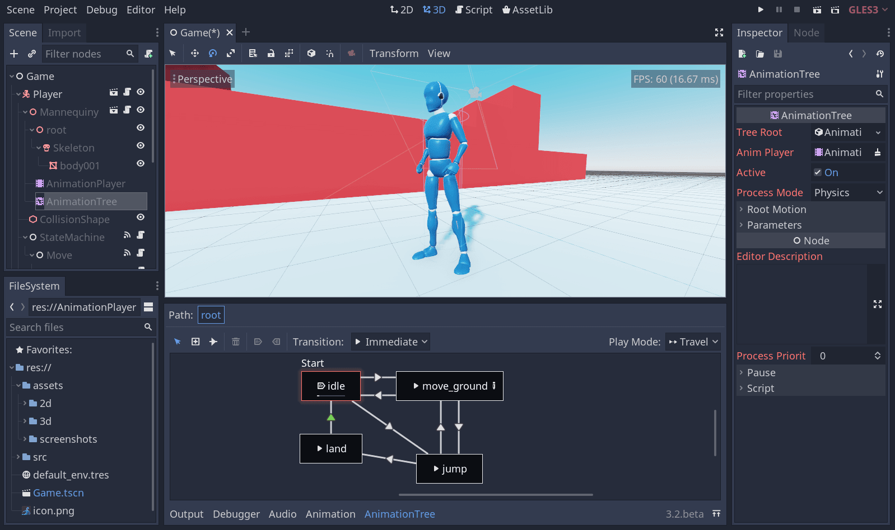

.. _doc_introduction_to_rebel:

Introduction to Rebel
=====================

This article is here to help you figure out whether Rebel might be a good fit
for you. We will introduce some broad features of the engine to give you a feel
for what you can achieve with it and answer questions such as "what do I need to
know to get started?".

This is by no means an exhaustive overview. We will introduce many more features
in this getting started series.

What is Rebel?
--------------

Rebel Engine is a general-purpose 2D and 3D game engine designed to support all sorts
of projects. You can use it to create games or applications you can then release
on desktop or mobile, as well as on the web.

You can also create console games with it, although you either need strong
programming skills or a developer to port the game for you.

.. note:: The Rebel Toolbox team can't provide an open-source console export due to the
          licensing terms imposed by console manufacturers. Regardless of the
          engine you use, though, releasing games on consoles is always a lot of
          work. You can read more on that here: :doc:`/tutorials/platform/consoles`.

How does it work and look?
--------------------------

Rebel comes with a fully-fledged Rebel Editor with integrated tools to answer the
most common needs. It includes a code editor, an animation editor, a tilemap
editor, a shader editor, a debugger, a profiler, and more.

The team strives to offer a feature-rich game editor with a consistent user
experience. While there is always room for improvement, the user interface keeps
getting refined.

Of course, if you prefer, you can work with external programs. We officially
support importing 3D scenes designed in Blender_. We also support Visual Studio for C# on
Windows.

.. image:: img/introduction_vscode.png

Programming languages
---------------------

Let's talk about the available programming languages.

You can code your games using :ref:`GDScript <toc-learn-scripting-gdscript>`, a
Rebel-specific and tightly integrated language with a lightweight syntax, or
:ref:`C# <toc-learn-scripting-C#>`, which is popular in the games industry.
These are the two main scripting languages we support.

Rebel Engine also supports a node-based visual programming language named
:ref:`VisualScript <toc-learn-scripting-visual_script>`.

With the :ref:`GDNative <toc-tutorials-gdnative>` technology, you can also write
gameplay or high-performance algorithms in C or C++ without recompiling the
engine. You can use this technology to integrate third-party libraries and other
Software Development Kits (SDK) in the engine.

Of course, you can also directly add modules and features to the engine, as it's
completely free and open-source.

.. seealso:: These are the five officially supported programming languages. The
             community maintains support for many more. For more information,
             see :ref:`GDNative third-party bindings
             <tutorials/scripting/gdnative/what_is_gdnative:version compatibility>`.

What do I need to know to use Rebel Engine?
-------------------------------------------

Rebel Engine is a feature-packed game engine. With its thousands of features, there is
a lot to learn. To make the most of it, you need good programming foundations.
While we try to make the engine accessible, you will benefit a lot from knowing
how to think like a programmer first.

Rebel Engine relies on the object-oriented programming paradigm. Being comfortable with
concepts such as classes and objects will help you code efficiently in it.

If you are entirely new to programming, we recommend following the `CS50 open
courseware`_ from Harvard University. It's a great free course that will teach
you everything you need to know to be off to a good start. It will save you
countless hours and hurdles learning any game engine afterward.

.. note:: In CS50, you will learn multiple programming languages. Don't be
          afraid of that: programming languages have many similarities. The
          skills you learn with one language transfer well to others.

We will provide you with more Rebel-specific learning resources in
:doc:`learning_new_features`.

In the next part, you will get an overview of the engine's essential concepts.

.. _Blender: https://www.blender.org/
.. _CS50 open courseware: https://cs50.harvard.edu/x
