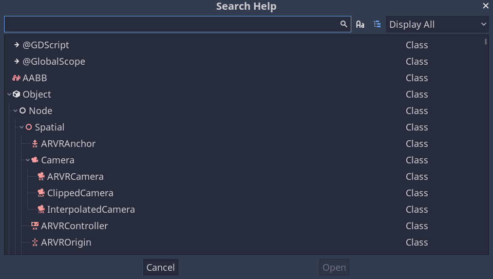

.. Keep this page short and sweet! We want users to read it to the end, so they
   know where to find information, how to get help, and how to maximize chances
   of getting answers.

.. _doc_learning_new_features:

Learning new features
=====================

Rebel Engine is a feature-rich game engine. There is a lot to learn about it. This page
explains how you can use the online manual, built-in code reference, and join
online communities to learn new features and techniques.

Making the most of this manual
------------------------------

What you are reading now is the user manual. It documents each of the engine's
concepts and available features. When learning a new topic, you can start by
browsing the corresponding section of this website. The left menu allows you to
explore broad topics while the search bar will help you find more specific
pages. If a page exists for a given theme, it will often link to more related
content.

The manual has a companion class reference that explains each Rebel Engine class's
available functions and properties when programming. While the manual covers
general features, concepts, and how to use the editor, the reference is all
about using Rebel Engine's scripting API (Application Programming Interface). You can
access it both online and offline. We recommend browsing the reference offline,
from within the Rebel Editor. To do so, go to Help -> Search or press
:kbd:`F1`.

To browse it online, head to the manual's :ref:`Class Reference <toc-class-ref>`
section.

A class reference's page tells you:

1. Where the class exists in the inheritance hierarchy. You can click the top
   links to jump to parent classes and see the properties and methods a type
   inherits.

   .. image:: img/manual_class_reference_inheritance.png

2. A summary of the class's role and use cases.

3. An explanation of the class's properties, methods, signals, enums, and
   constants.

4. Links to manual pages further detailing the class.

.. note:: If the manual or class reference is missing or has insufficient
          information, please open an Issue in the official `Rebel Documentation
          <https://github.com/RebelToolbox/RebelDocumentation>`_ GitHub repository
          to report it.

You can Ctrl-click any underlined text like the name of a class, property,
method, signal, or constant to jump to it.

Learning to think like a programmer
-----------------------------------

Teaching programming foundations and how to think like a game developer is
beyond the scope of the Rebel Documentation. If you're new to programming, we
recommend two excellent free resources to get you started:

1. Harvard university offers a free courseware to learn to program, `CS50
   <https://cs50.harvard.edu/x/>`_. It will teach you programming
   fundamentals, how code works, and how to think like a programmer. These
   skills are essential to become a game developer and learn any game engine
   efficiently. You can see this course as an investment that will save you time
   and trouble when you learn to create games.

2. If you prefer books, check out the free ebook `Automate The Boring Stuff With
   Python <https://automatetheboringstuff.com/>`_ by Al Sweigart.

Learning with the community
---------------------------

Rebel Toolbox has a growing community of users.

Asking questions well and providing details will help others answer you faster
and better. When asking questions, we recommend including the following
information:

1. **Describe your goal**. You want to explain what you are trying to achieve
   design-wise. If you are having trouble figuring out how to make a solution
   work, there may be a different, easier solution that accomplishes the same
   goal.

2. If there is an error involved, **share the exact error message**. You
   can copy the exact error message in the editor's Debugger bottom panel by
   clicking the Copy Error icon. Knowing what it says can help community members
   better identify how you triggered the error.

3. If there is code involved, **share a code sample**. Other users won't be able
   to help you fix a problem without seeing your code. Share the code as text
   directly. To do so, you can copy and paste a short code snippet in a chat
   box, or use a website like `Pastebin <https://pastebin.com/>`_ to share long
   files.

4. **Share a screenshot** of your *Scene* dock along with your written code. Most of
   the code you write affects nodes in your scenes. As a result, you should
   think of those scenes as part of your source code.

   .. image:: img/key_concepts_scene_tree.png

   Also, please don't take a picture with your phone, the low quality and screen
   reflections can make it hard to understand the image. Your operating system
   should have a built-in tool to take screenshots with the :kbd:`PrtSc` (Print
   Screen) key.

   Alternatively, you can use a program like `ShareX <https://getsharex.com/>`_
   on Windows or `FlameShot <https://flameshot.org/>`_ on Linux.

5. Sharing a video of your running game can also be really **useful to
   troubleshoot your game**. You can use programs like `OBS Studio
   <https://obsproject.com/>`_ and `Screen to GIF
   <https://www.screentogif.com/>`_ to capture your screen.

   You can then use a service like `streamable <https://streamable.com/>`_ or a
   cloud provider to upload and share your videos for free.

6. If you're not using the stable version of Rebel Engine, please mention the version
   you're using. The answer can be different as available features and the
   interface evolve rapidly.

Following these guidelines will maximize your chances of getting the answer
you're looking for. They will save time both to you and the persons helping you.
