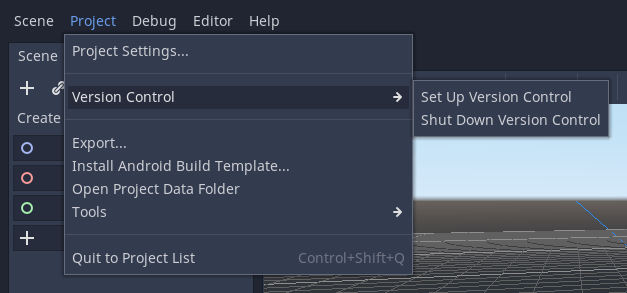

.. _doc_version_control_systems:

Version Control Systems
=======================

Introduction
------------

Rebel aims to be VCS friendly and generate mostly readable and mergeable files.
Rebel also supports the use of version control systems in the editor itself.
However, VCS in the editor requires a plugin for the specific VCS you are using.
VCS can be setup or shut down in the editor under **Project > Version Control**.

Files to exclude from VCS
-------------------------

There are some folders Rebel Editor creates you should have your VCS ignore:

- ``.import/``: This folder stores all the files it imports automatically based on
  your source assets and their import flags.
- ``*.translation``: These files are binary imported translations generated from CSV files.
- ``export_presets.cfg``: This file contains all the export presets for the
  project, including sensitive information such as Android keystore credentials.
- ``.mono/``: This folder stores automatically-generated Mono files. It only exists
  in projects that use the Mono version of Rebel Engine.

Working with Git on Windows
---------------------------

Most Git for Windows clients are configured with the ``core.autocrlf`` set to ``true``.
This can lead to files unnecessarily being marked as modified by Git due to their line endings being converted automatically.
It is better to set this option as::

    git config --global core.autocrlf input
