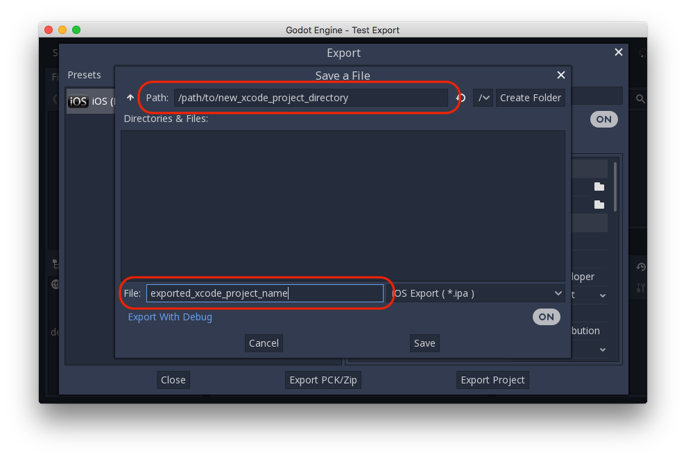
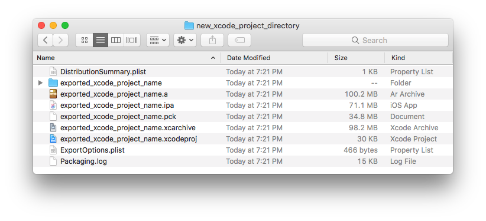
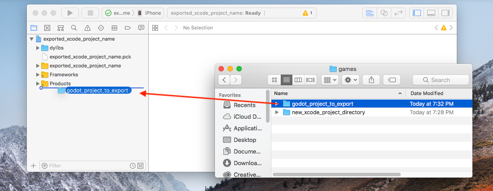
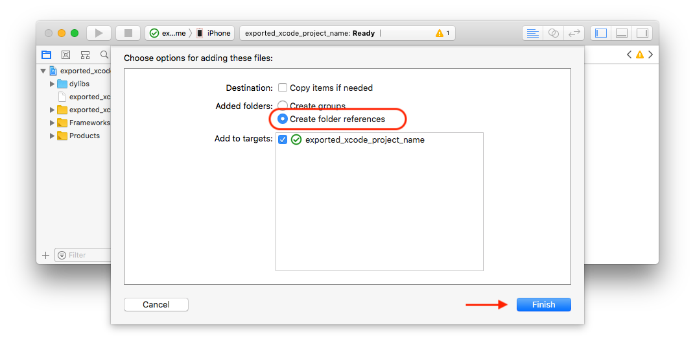
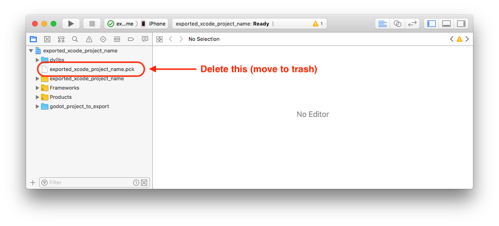
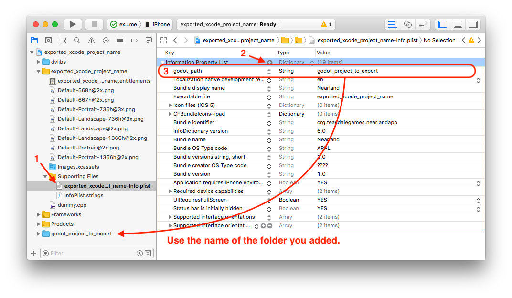

.. _doc_exporting_for_ios:

Exporting for iOS
=================

.. seealso::

    This page describes how to export a Rebel project to iOS.
    If you're looking to compile export template binaries from source instead,
    read :doc:`/development/compiling/compiling_for_ios`.

These are the steps to load a Rebel project in Xcode. This allows you to
build and deploy to an iOS device, build a release for the App Store, and
do everything else you can normally do with Xcode.

Requirements
------------

-  You must export for iOS from a computer running macOS with Xcode installed.
-  Download the Rebel export templates. Use the Rebel Editor menu: Editor > Manage Export Templates

Export a Rebel project to Xcode
-------------------------------

In Rebel Editor, open the **Export** window from the **Project** menu. When the
Export window opens, click **Add..** and select **iOS**.

The following export options are required. Leaving any blank will cause the
exporter to throw an error:

  * In the **Application** category
    * **App Store Team ID** and (Bundle) **Identifier**
  * Everything in the **Required Icons** category
  * Everything in the **Landscape Launch Screens** category
  * Everything in the **Portrait Launch Screens** category

After you click **Export Project**, there are still two important options left:

  * **Path** is an empty folder that will contain the exported Xcode project files.
  * **File** will be the name of the Xcode project and several project specific files and directories.

.. note:: This tutorial uses **exported_xcode_project_name**, but you will use your
          project's name. When you see **exported_xcode_project_name**
          in the following steps, replace it with the name you used instead.

.. note:: Avoid using spaces when you choose your **exported_xcode_project_name** as
          this can lead to corruption in your XCode project file.

When the export completes, the output folder should look like this:

Opening **exported_xcode_project_name.xcodeproj** lets you build and deploy
like any other iOS app.

Active development considerations
---------------------------------

The above method creates an exported project that you can build for
release, but you have to re-export every time you make a change in Rebel Editor.

While developing, you can speed this process up by linking your
Rebel project files directly into your app.

In the following example:

  * **exported_xcode_project_name** is the name of the exported iOS application (as above).
  * **rebel_project_to_export** is the name of the Rebel project.

.. note:: **rebel_project_to_export** must not be the same as **exported_xcode_project_name**
          to prevent signing issues in Xcode.

Steps to link a Rebel project folder to Xcode
~~~~~~~~~~~~~~~~~~~~~~~~~~~~~~~~~~~~~~~~~~~~~

1. Start from an exported iOS project (follow the steps above).
2. In Finder, drag the Rebel project folder into the Xcode file browser.

3. In the dialog, make sure **Create folder references** is selected. This means
you will be able to continue to edit your Rebel project in its current location.

4. See the **rebel_project_to_export** folder in the Xcode file browser.
5. Delete **exported_xcode_project_name.pck** from the Xcode project.

6. Open **exported_xcode_project_name-Info.plist** and add a string property named
**rebel_path** (this is the real key name) with a value **rebel_project_to_export**
(this is the name of your project)

That's it! You can now edit your project in the Rebel Editor and build it
in Xcode when you want to run it on a device.

Plugins for iOS
---------------

Special iOS plugins can be used in Rebel Engine.

Troubleshooting rendering issues
--------------------------------

To improve out-of-the-box performance on mobile devices, Rebel Engine automatically
uses low-end-friendly settings by default on both Android and iOS.

This can cause rendering issues that do not occur when running the project on a
desktop platform. See :doc:`/tutorials/platform/mobile_rendering_limitations` for more information.
