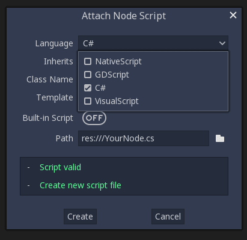

C# basics
=========

Introduction
------------

.. warning:: C# support is a new feature.
             As such, you may still run into some issues, or find spots
             where the documentation could be improved.
             Please report issues with C# in Rebel Engine on the
             `engine GitHub page <https://github.com/RebelToolbox/RebelEngine/issues>`_,
             and any documentation issues on the
             `documentation GitHub page <https://github.com/RebelToolbox/RebelDocumentation/issues>`_.

This page provides a brief introduction to C#, both what it is and
how to use it in Rebel Engine. Afterwards, you may want to look at
:doc:`how to use specific features </tutorials/scripting/c_sharp/c_sharp_features>`, read about the
:doc:`differences between the C# and the GDScript API </tutorials/scripting/c_sharp/c_sharp_differences>`
and (re)visit the :doc:`Scripting section </getting_started/step_by_step/scripting_languages>` of the
step-by-step tutorial.

C# is a high-level programming language developed by Microsoft. In Rebel Engine,
it is implemented with the Mono 6.x .NET framework, including full support
for C# 8.0. Mono is an open source implementation of Microsoft's .NET Framework
based on the ECMA standards for C# and the Common Language Runtime.
A good starting point for checking its capabilities is the
`Compatibility <https://www.mono-project.com/docs/about-mono/compatibility/>`_
page in the Mono documentation.

.. note:: This is **not** a full-scale tutorial on the C# language as a whole.
        If you aren't already familiar with its syntax or features,
        see the
        `Microsoft C# guide <https://learn.microsoft.com/en-us/dotnet/csharp/>`_
        or look for a suitable introduction elsewhere.

Setting up C# for Rebel Engine
------------------------------

Prerequisites
~~~~~~~~~~~~~

Install the latest stable version of the
`.NET SDK <https://dotnet.microsoft.com/download>`__, previously known as the
.NET Core SDK.

Installing Mono SDK is not a requirement anymore,
except it is required if you are building the engine from source.

Rebel Engine bundles the parts of Mono needed to run already compiled games.
However, Rebel Engine does not bundle the tools required to build and compile
games, such as MSBuild and the C# compiler. These are
included in the .NET SDK, which needs to be installed separately.

In summary, you must have installed the .NET SDK
**and** the Mono-enabled version of Rebel Engine.

Additional notes
~~~~~~~~~~~~~~~~

Be sure to install the 64-bit version of the SDK(s)
if you are using the 64-bit version of Rebel Engine.

If you are building Rebel Engine from source, install the latest stable version of
`Mono <https://www.mono-project.com/download/stable/>`__, and make sure to
follow the steps to enable Mono support in your build as outlined in the
:doc:`/development/compiling/compiling_with_mono` page.

Configuring an external editor
------------------------------

C# support in Rebel Editor's built-in script editor is minimal. Consider using an
external IDE or editor, such as  `Visual Studio Code <https://code.visualstudio.com/>`__
or MonoDevelop. These provide autocompletion, debugging, and other
useful features for C#. To select an external editor in Rebel Editor,
click on **Editor → Editor Settings** and scroll down to
**Mono**. Under **Mono**, click on **Editor**, and select your
external editor of choice. Rebel Editor currently supports the following
external editors:

- Visual Studio 2019
- Visual Studio Code
- MonoDevelop
- Visual Studio for Mac
- JetBrains Rider

See the following sections for how to configure an external editor:

JetBrains Rider
~~~~~~~~~~~~~~~

After reading the "Prerequisites" section, you can download and install
`JetBrains Rider <https://www.jetbrains.com/rider/download>`__.

In Rebel Editor's **Editor → Editor Settings** menu:

- Set **Mono** -> **Editor** -> **External Editor** to **JetBrains Rider**.
- Set **Mono** -> **Builds** -> **Build Tool** to **dotnet CLI**.

In Rider:

- Set **MSBuild version** to **.NET Core**.
- Install the **Rebel support** plugin.

Visual Studio Code
~~~~~~~~~~~~~~~~~~

After reading the "Prerequisites" section, you can download and install
`Visual Studio Code <https://code.visualstudio.com/download>`__ (aka VS Code).

In Rebel Editor's **Editor → Editor Settings** menu:

- Set **Mono** -> **Editor** -> **External Editor** to **Visual Studio Code**.
- Set **Mono** -> **Builds** -> **Build Tool** to **dotnet CLI**.

In Visual Studio Code:

- Install the `C# <https://marketplace.visualstudio.com/items?itemName=ms-dotnettools.csharp>`__ extension.
- Install the `Mono Debug <https://marketplace.visualstudio.com/items?itemName=ms-vscode.mono-debug>`__ extension.
- Install the `C# Tools for Godot <https://marketplace.visualstudio.com/items?itemName=neikeq.godot-csharp-vscode>`__ extension.

.. note:: If you are using Linux you need to install the
          `Mono SDK <https://www.mono-project.com/download/stable/#download-lin>`__
          for the C# tools plugin to work.

To configure a project for debugging open the Rebel project folder in VS Code.
Go to the Run tab and click on **Add Configuration...**. Select **C# Godot**
from the dropdown menu. Open the ``tasks.json`` and ``launch.json`` files that
were created. Change the executable setting in ``launch.json`` and  command
settings in ``tasks.json`` to your Rebel Editor executable path. Now, when you start
the debugger in VS Code, your Rebel project will run.

Visual Studio (Windows only)
~~~~~~~~~~~~~~~~~~~~~~~~~~~~

Download and install the latest version of
`Visual Studio <https://visualstudio.microsoft.com/downloads/>`__.
Visual Studio will include the required SDKs if you have the correct
workloads selected, so you don't need to manually install the things
listed in the "Prerequisites" section.

While installing Visual Studio, select these workloads:

- Mobile development with .NET
- .NET Core cross-platform development

In Rebel Editor's **Editor → Editor Settings** menu:

- Set **Mono** -> **Editor** -> **External Editor** to **Visual Studio**.
- Set **Mono** -> **Builds** -> **Build Tool** to **dotnet CLI**.

Next, you can download the Godot Visual Studio extension from github
`here <https://github.com/godotengine/godot-csharp-visualstudio/releases>`__.
Double click on the downloaded file and follow the installation process.

.. note:: The option to debug your game in Visual Studio may not appear after
          installing the extension. To enable debugging, there is a
          `workaround for Visual Studio 2019 <https://github.com/godotengine/godot-csharp-visualstudio/issues/10#issuecomment-720153256>`__.
          There is
          `a separate issue about this problem in Visual Studio 2022 <https://github.com/godotengine/godot-csharp-visualstudio/issues/28>`__.

.. note:: If you see an error like "Unable to find package Godot.NET.Sdk",
          your NuGet configuration may be incorrect and need to be fixed.

          A simple way to fix the NuGet configuration file is to regenerate it.
          In a file explorer window, go to ``%AppData%\NuGet``. Rename or delete
          the ``NuGet.Config`` file. When you build your Rebel project again,
          the file will be automatically created with default values.

Creating a C# script
--------------------

After you successfully set up C# for Rebel Editor, you should see the following option
when selecting **Attach Script** in the context menu of a node in your scene:

Note that while some specifics change, most concepts work the same
when using C# for scripting. If you're new to Rebel, you may want to follow
the tutorials on :doc:`/getting_started/step_by_step/scripting_languages` at this point.
While some places in the documentation still lack C# examples, most concepts
can be transferred easily from GDScript.

Project setup and workflow
--------------------------

When you create the first C# script, Rebel Editor initializes the C# project files
for your Rebel project. This includes generating a C# solution (``.sln``)
and a project file (``.csproj``), as well as some utility files and folders
(``.mono`` and ``Properties/AssemblyInfo.cs``).
All of these but ``.mono`` are important and should be committed to your
version control system. ``.mono`` can be safely added to the ignore list of your VCS.
When troubleshooting, it can sometimes help to delete the ``.mono`` folder
and let it regenerate.

Example
-------

Here's a blank C# script with some comments to demonstrate how it works.

.. code-block:: csharp

    using Godot;
    using System;

    public class YourCustomClass : Node
    {
        // Member variables here, example:
        private int a = 2;
        private string b = "textvar";

        public override void _Ready()
        {
            // Called every time the node is added to the scene.
            // Initialization here.
            GD.Print("Hello from C# to Rebel :)");
        }

        public override void _Process(float delta)
        {
            // Called every frame. Delta is time since the last frame.
            // Update game logic here.
        }
    }

As you can see, functions normally in global scope in GDScript like Rebel Engine's
``print`` function are available in the ``GD`` class which is part of
the ``Godot`` namespace. For a list of methods in the ``GD`` class, see the
API documentation pages for
:ref:`@GDScript <class_@gdscript>` and :ref:`@GlobalScope <class_@globalscope>`.

.. note::
    Keep in mind that the class you wish to attach to your node should have the same
    name as the ``.cs`` file. Otherwise, you will get the following error
    and won't be able to run the scene:
    *"Cannot find class XXX for script res://XXX.cs"*

General differences between C# and GDScript
-------------------------------------------

The C# API uses ``PascalCase`` instead of ``snake_case`` in GDScript/C++.
Where possible, fields and getters/setters have been converted to properties.
In general, the C# Rebel Engine API strives to be as idiomatic as is reasonably possible.

For more information, see the :doc:`c_sharp_differences` page.

.. warning::

    You need to (re)build the project assemblies whenever you want to see new
    exported variables or signals in the editor. This build can be manually
    triggered by clicking the word **Build** in the top right corner of the
    editor. You can also click **Mono** at the bottom of the editor window
    to reveal the Mono panel, then click the **Build Project** button.

    You will also need to rebuild the project assemblies to apply changes in
    "tool" scripts.

Current gotchas and known issues
--------------------------------

As C# support is quite new in Rebel Engine, there are some growing pains and things
that need to be ironed out. Below is a list of the most important issues
you should be aware of when diving into C# in Rebel Engine:

- Writing editor plugins is possible, but it is currently quite convoluted.
- State is currently not saved and restored when hot-reloading,
  with the exception of exported variables.
- Attached C# scripts should refer to a class that has a class name
  that matches the file name.
- There are some methods such as ``Get()``/``Set()``, ``Call()``/``CallDeferred()``
  and signal connection method ``Connect()`` that rely on Rebel Engine's ``snake_case`` API
  naming conventions.
  So when using e.g. ``CallDeferred("AddChild")``, ``AddChild`` will not work because
  the API is expecting the original ``snake_case`` version ``add_child``. However, you
  can use any custom properties or methods without this limitation.

Exporting Mono projects is supported for desktop platforms (Linux, Windows and
macOS), Android, HTML5, and iOS. The only platform not supported yet is UWP.

Performance of C# in Rebel Engine
---------------------------------

According to some preliminary `benchmarks <https://github.com/cart/godot3-bunnymark>`_,
the performance of C# in Rebel Engine — while generally in the same order of magnitude
— is roughly **~4×** that of GDScript in some naive cases. C++ is still
a little faster; the specifics are going to vary according to your use case.
GDScript is likely fast enough for most general scripting workloads.
C# is faster, but requires some expensive marshalling when talking to Rebel Engine.

Using NuGet packages in Rebel Engine
------------------------------------

`NuGet <https://www.nuget.org/>`_ packages can be installed and used with Rebel Engine,
as with any C# project. Many IDEs are able to add packages directly.
They can also be added manually by adding the package reference in
the ``.csproj`` file located in the project root:

.. code-block:: xml
    :emphasize-lines: 2

        <ItemGroup>
            <PackageReference Include="Newtonsoft.Json" Version="11.0.2" />
        </ItemGroup>
        ...
    </Project>

Rebel Editor automatically downloads and sets up newly added NuGet
packages the next time it builds the project.

Profiling your C# code
----------------------

- `Mono log profiler <https://www.mono-project.com/docs/debug+profile/profile/profiler/>`_ is available for Linux and macOS. Due to a Mono change, it does not work on Windows currently.
- External Mono profiler like `JetBrains dotTrace <https://www.jetbrains.com/profiler/>`_ can be used as described `here <https://github.com/godotengine/godot/pull/34382>`_.
