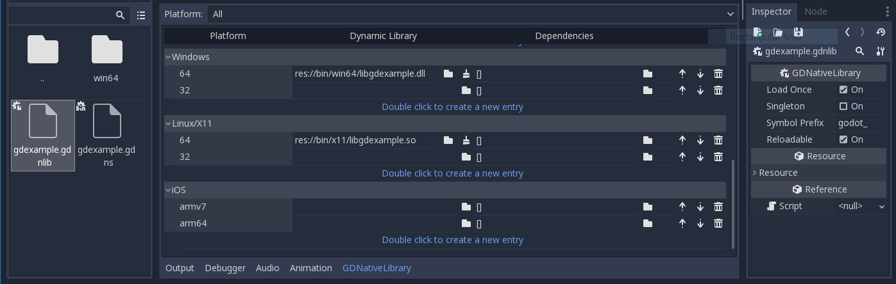
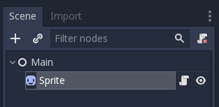
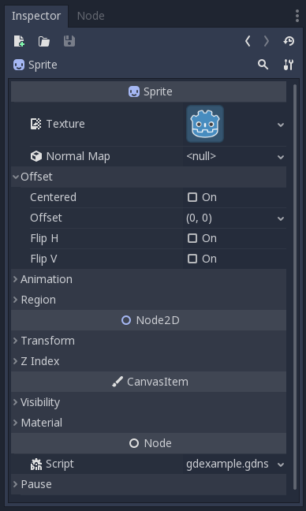
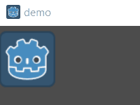

.. _doc_gdnative_cpp_example:

GDNative C++ example
====================

Introduction
------------

This tutorial builds on top of the information given in the
:ref:`GDNative C example <doc_gdnative_c_example>`, so we highly recommend you
read that first.

The C++ bindings for GDNative are built on top of the NativeScript GDNative API
and provide a nicer way to "extend" nodes in Rebel Engine using C++. This is equivalent
to writing scripts in GDScript, but in C++ instead.

You can download the full example we'll be creating in this tutorial here:
:download:`GDNative CPP <files/gdnative-cpp.zip>`

Setting up the project
----------------------

There are a few prerequisites you'll need:

- a Rebel Engine executable,
- a C++ compiler,
- SCons as a build tool,
- a copy of the `godot-cpp
  repository <https://github.com/godotengine/godot-cpp/tree/3.4>`__.

See also :ref:`Compiling <toc-devel-compiling>` as the build tools are identical
to the ones you need to compile Rebel Engine from source.

.. note::

    Rebel Engine is forked from Godot 3.4.5, but C++ GDNative bindings have not.
    You need to use the ``3.4`` branch of godot-cpp to use GDNative and follow this example.

GDNative modules written for an earlier version of Rebel Engine will work in
newer versions, but not vice versa so make sure you download the correct
branch. Also note that the version of Rebel Engine you use to generate the ``api.json``
with becomes your minimum version.

Make sure to keep the folder layout identical to the one described here,
as much of the code we'll be showcasing here assumes the project follows this
layout.

.. note::

    ``godot-cpp`` includes ``godot-headers`` as a nested submodule,
    please make sure to place ``godot-headers`` inside
    of the ``godot-cpp`` folder.

    You don't have to do it this way, but we've found it easiest to manage. If you
    decide to download the repositories or clone them into your folder,
    make sure to keep the folder layout the same as we've setup here. Much of
    the code we'll be showcasing here assumes the project has this layout.

Building the C++ bindings
-------------------------

Now that we've downloaded our prerequisites, it is time to build the C++
bindings.

The repository contains a copy of the metadata for the current Rebel Engine release,
but if you need to build these bindings for a newer version of Rebel Engine, simply
call the Rebel Engine executable:

.. code-block:: none

    rebel --gdnative-generate-json-api api.json

Place the resulting ``api.json`` file in the project folder and add
``use_custom_api_file=yes custom_api_file=../api.json`` to the scons command
below.

To generate and compile the bindings, use this command (replacing ``<platform>``
with ``windows``, ``linux`` or ``osx`` depending on your OS):

To speed up compilation, add `-jN` at the end of the SCons command line where `N`
is the number of CPU threads you have on your system. The example below uses 4 threads.

.. code-block:: none

    cd godot-cpp
    scons platform=<platform> generate_bindings=yes -j4
    cd ..

This step will take a while. When it is completed, you should have static
libraries that can be compiled into your project stored in ``godot-cpp/bin/``.

.. note::

    You may need to add ``bits=64`` to the command on Windows or Linux.

Creating a simple plugin
------------------------

Now it's time to build an actual plugin. We'll start by creating an empty Rebel
Project in which we'll place a few files.

Open Rebel Editor and create a new project. For this example, we will place it in a
folder called ``demo`` inside our GDNative module's folder structure.

In our demo project, we'll create a scene containing a Node called "Main" and
we'll save it as ``main.tscn``. We'll come back to that later.

Back in the top-level GDNative module folder, we're also going to create a
subfolder called ``src`` in which we'll place our source files.

You should now have ``demo``, ``godot-cpp``, ``godot-headers``, and ``src``
directories in your GDNative module.

In the ``src`` folder, we'll start with creating our header file for the
GDNative node we'll be creating. We will name it ``gdexample.h``:

.. code-block:: C++

    #ifndef GDEXAMPLE_H
    #define GDEXAMPLE_H

    #include <Godot.hpp>
    #include <Sprite.hpp>

    namespace godot {

    class GDExample : public Sprite {
        GODOT_CLASS(GDExample, Sprite)

    private:
        float time_passed;

    public:
        static void _register_methods();

        GDExample();
        ~GDExample();

        void _init(); // our initializer called by Rebel Engine

        void _process(float delta);
    };

    }

    #endif

There are a few things of note to the above. We're including ``Godot.hpp`` which
contains all our basic definitions. After that, we include ``Sprite.hpp`` which
contains bindings to the Sprite class. We'll be extending this class in our
module.

We're using the namespace ``godot``, since everything in GDNative is defined
within this namespace.

Then we have our class definition, which inherits from our Sprite through a
container class. We'll see a few side effects of this later on. The
``GODOT_CLASS`` macro sets up a few internal things for us.

After that, we declare a single member variable called ``time_passed``.

In the next block we're defining our methods, we obviously have our constructor
and destructor defined, but there are two other functions that will likely look
familiar to some, and one new method.

The first is ``_register_methods``, which is a static function that Rebel Engine will
call to find out which methods can be called on our NativeScript and which
properties it exposes. The second is our ``_process`` function, which will work
exactly the same as the ``_process`` function you're used to in GDScript. The
third is our ``_init`` function which is called after Rebel Engine has properly set up
our object. It has to exist even if you don't place any code in it.

Let's implement our functions by creating our ``gdexample.cpp`` file:

.. code-block:: C++

    #include "gdexample.h"

    using namespace godot;

    void GDExample::_register_methods() {
        register_method("_process", &GDExample::_process);
    }

    GDExample::GDExample() {
    }

    GDExample::~GDExample() {
        // add your cleanup here
    }

    void GDExample::_init() {
        // initialize any variables here
        time_passed = 0.0;
    }

    void GDExample::_process(float delta) {
        time_passed += delta;

        Vector2 new_position = Vector2(10.0 + (10.0 * sin(time_passed * 2.0)), 10.0 + (10.0 * cos(time_passed * 1.5)));

        set_position(new_position);
    }

This one should be straightforward. We're implementing each method of our class
that we defined in our header file. Note that the ``register_method`` call
**must** expose the ``_process`` method, otherwise Rebel Engine will not be able to use
it. However, we do not have to tell Rebel Engine about our constructor, destructor and
``_init`` functions.

The other method of note is our ``_process`` function, which simply keeps track
of how much time has passed and calculates a new position for our sprite using a
sine and cosine function. What stands out is calling
``owner->set_position`` to call one of the built-in methods of our Sprite. This
is because our class is a container class; ``owner`` points to the actual Sprite
node our script relates to.

There is one more C++ file we need; we'll name it ``gdlibrary.cpp``. Our
GDNative plugin can contain multiple NativeScripts, each with their own header
and source file like we've implemented ``GDExample`` up above. What we need now
is a small bit of code that tells Rebel Engine about all the NativeScripts in our
GDNative plugin.

.. code-block:: C++

    #include "gdexample.h"

    extern "C" void GDN_EXPORT godot_gdnative_init(godot_gdnative_init_options *o) {
        godot::Godot::gdnative_init(o);
    }

    extern "C" void GDN_EXPORT godot_gdnative_terminate(godot_gdnative_terminate_options *o) {
        godot::Godot::gdnative_terminate(o);
    }

    extern "C" void GDN_EXPORT godot_nativescript_init(void *handle) {
        godot::Godot::nativescript_init(handle);

        godot::register_class<godot::GDExample>();
    }

Note that we are not using the ``godot`` namespace here, since the three
functions implemented here need to be defined without a namespace.

The ``godot_gdnative_init`` and ``godot_gdnative_terminate`` functions get
called respectively when Rebel Engine loads our plugin and when it unloads it. All
we're doing here is parse through the functions in our bindings module to
initialize them, but you might have to set up more things depending on your
needs.

The important function is the third function called ``godot_nativescript_init``.
We first call a function in our bindings library that does its usual stuff.
After that, we call the function ``register_class`` for each of our classes in
our library.

Compiling the plugin
--------------------

We cannot easily write by hand a ``SConstruct`` file that SCons would use for
building. For the purpose of this example, just use
:download:`this hardcoded SConstruct file <files/cpp_example/SConstruct>` we've
prepared. We'll cover a more customizable, detailed example on how to use these
build files in a subsequent tutorial.

.. note::

    This ``SConstruct`` file was written to be used with the latest ``godot-cpp``
    master, you may need to make small changes using it with older versions or
    refer to the ``SConstruct`` file in the Rebel Engine documentation.

Once you've downloaded the ``SConstruct`` file, place it in your GDNative module
folder besides ``godot-cpp``, ``godot-headers`` and ``demo``, then run:

.. code-block:: none

    scons platform=<platform>

You should now be able to find the module in ``demo/bin/<platform>``.

.. note::

    Here, we've compiled both godot-cpp and our gdexample library as debug
    builds. For optimized builds, you should compile them using the
    ``target=release`` switch.

Using the GDNative module
-------------------------

Before we jump back into Rebel Editor, we need to create two more files in
``demo/bin/``. Both can be created using the Rebel Editor, but it may be faster
to create them directly.

The first one is a file that lets Rebel Engine know what dynamic libraries should be
loaded for each platform and is called ``gdexample.gdnlib``.

.. code-block:: none

    [general]

    singleton=false
    load_once=true
    symbol_prefix="godot_"
    reloadable=false

    [entry]

    X11.64="res://bin/x11/libgdexample.so"
    Windows.64="res://bin/win64/libgdexample.dll"
    OSX.64="res://bin/osx/libgdexample.dylib"

    [dependencies]

    X11.64=[]
    Windows.64=[]
    OSX.64=[]

This file contains a ``general`` section that controls how the module is loaded.
It also contains a prefix section which should be left on ``godot_`` for now. If
you change this, you'll need to rename various functions that are used as entry
points. This was added for the iPhone platform because it doesn't allow dynamic
libraries to be deployed, yet GDNative modules are linked statically.

The ``entry`` section is the important bit: it tells Rebel Engine the location of the
dynamic library in the project's filesystem for each supported platform. It will
also result in *just* that file being exported when you export the project,
which means the data pack won't contain libraries that are incompatible with the
target platform.

Finally, the ``dependencies`` section allows you to name additional dynamic
libraries that should be included as well. This is important when your GDNative
plugin implements someone else's library and requires you to supply a
third-party dynamic library with your project.

If you double click on the ``gdexample.gdnlib`` file within Rebel Engine, you'll see
there are far more options to set:

The second file we need to create is a file used by each NativeScript we've
added to our plugin. We'll name it ``gdexample.gdns`` for our gdexample
NativeScript.

.. code-block:: none

    [gd_resource type="NativeScript" load_steps=2 format=2]

    [ext_resource path="res://bin/gdexample.gdnlib" type="GDNativeLibrary" id=1]

    [resource]

    resource_name = "gdexample"
    class_name = "GDExample"
    library = ExtResource( 1 )

This is a standard Rebel Resource; you could just create it directly in your
scene, but saving it to a file makes it much easier to reuse it in other places.
This resource points to our gdnlib file, so that Rebel Engine can know which dynamic
library contains our NativeScript. It also defines the ``class_name`` which
identifies the NativeScript in our plugin we want to use.

Time to jump back into Rebel Editor. We load up the main scene we created way back in
the beginning and now add a Sprite to our scene:

We're going to assign the Rebel logo to this sprite as our texture, disable the
``centered`` property and drag our ``gdexample.gdns`` file onto the ``script``
property of the sprite:

We're finally ready to run the project:

Adding properties
-----------------

GDScript allows you to add properties to your script using the ``export``
keyword. In GDNative you have to register the properties and there are two ways
of doing this. You can either bind directly to a member or use a setter and
getter function.

.. note::

    There is a third option, just like in GDScript you can directly implement the
    ``_get_property_list``, ``_get`` and ``_set`` methods of an object but that
    goes far beyond the scope of this tutorial.

We'll examine both starting with the direct bind. Lets add a property that
allows us to control the amplitude of our wave.

In our ``gdexample.h`` file we simply need to add a member variable like so:

.. code-block:: C++

    ...
    private:
        float time_passed;
        float amplitude;
    ...

In our ``gdexample.cpp`` file we need to make a number of changes, we will only
show the methods we end up changing, don't remove the lines we're omitting:

.. code-block:: C++

    void GDExample::_register_methods() {
        register_method("_process", &GDExample::_process);
        register_property<GDExample, float>("amplitude", &GDExample::amplitude, 10.0);
    }

    void GDExample::_init() {
        // initialize any variables here
        time_passed = 0.0;
        amplitude = 10.0;
    }

    void GDExample::_process(float delta) {
        time_passed += delta;

        Vector2 new_position = Vector2(
            amplitude + (amplitude * sin(time_passed * 2.0)),
            amplitude + (amplitude * cos(time_passed * 1.5))
        );

        set_position(new_position);
    }

Once you compile the module with these changes in place, you will see that a
property has been added to our interface. You can now change this property and
when you run your project, you will see that our Rebel icon travels along a
larger figure.

.. note::

    The ``reloadable`` property in the ``gdexample.gdnlib`` file must be set to
    ``true`` for the Rebel Editor to automatically pick up the newly added
    property.

    However, this setting should be used with care, especially when tool classes
    are used, as the editor might hold objects then that have script instances
    attached to them that are managed by a GDNative library.

Let's do the same but for the speed of our animation and use a setter and getter
function. Our ``gdexample.h`` header file again only needs a few more lines of
code:

.. code-block:: C++

    ...
        float amplitude;
        float speed;
    ...
        void _process(float delta);
        void set_speed(float p_speed);
        float get_speed();
    ...

This requires a few more changes to our ``gdexample.cpp`` file, again we're only
showing the methods that have changed so don't remove anything we're omitting:

.. code-block:: C++

    void GDExample::_register_methods() {
        register_method("_process", &GDExample::_process);
        register_property<GDExample, float>("amplitude", &GDExample::amplitude, 10.0);
        register_property<GDExample, float>("speed", &GDExample::set_speed, &GDExample::get_speed, 1.0);
    }

    void GDExample::_init() {
        // initialize any variables here
        time_passed = 0.0;
        amplitude = 10.0;
        speed = 1.0;
    }

    void GDExample::_process(float delta) {
        time_passed += speed * delta;

        Vector2 new_position = Vector2(
            amplitude + (amplitude * sin(time_passed * 2.0)),
            amplitude + (amplitude * cos(time_passed * 1.5))
        );

        set_position(new_position);
    }

    void GDExample::set_speed(float p_speed) {
        speed = p_speed;
    }

    float GDExample::get_speed() {
        return speed;
    }

Now when the project is compiled, we'll see another property called speed.
Changing its value will make the animation go faster or slower.

For this example, there is no obvious advantage of using a setter and getter.
A good reason for a setter would be if you wanted to react on the variable being changed.
If you don't need to do something like that, binding the variable is enough.

Getters and setters become far more useful in more complex scenarios where you
need to make additional choices based on the state of your object.

.. note::

    For simplicity, we've left out the optional parameters in the
    register_property<class, type> method call. These parameters are
    ``rpc_mode``, ``usage``, ``hint`` and ``hint_string``. These can be used to
    further configure how properties are displayed and set on the Rebel Engine side.

    Modern C++ compilers are able to infer the class and variable type and allow
    you to omit the ``<GDExample, float>`` part of our ``register_property``
    method. We've had mixed experiences with this however.

Signals
-------

Last but not least, signals fully work in GDNative as well. Having your module
react to a signal given out by another object requires you to call ``connect``
on that object. We can't think of a good example for our wobbling Rebel icon, we
would need to showcase a far more complete example.

This is the required syntax:

.. code-block:: C++

    some_other_node->connect("the_signal", this, "my_method");

Note that you can only call ``my_method`` if you've previously registered it in
your ``_register_methods`` method.

Having your object sending out signals is more common. For our wobbling
Rebel icon, we'll do something silly just to show how it works. We're going to
emit a signal every time a second has passed and pass the new location along.

In our ``gdexample.h`` header file, we need to define a new member ``time_emit``:

.. code-block:: C++

    ...
        float time_passed;
        float time_emit;
        float amplitude;
    ...

This time, the changes in ``gdexample.cpp`` are more elaborate. First,
you'll need to set ``time_emit = 0.0;`` in either our ``_init`` method or in our
constructor. We'll look at the other 2 needed changes one by one.

In our ``_register_methods`` method, we need to declare our signal. This is done
as follows:

.. code-block:: C++

    void GDExample::_register_methods() {
        register_method("_process", &GDExample::_process);
        register_property<GDExample, float>("amplitude", &GDExample::amplitude, 10.0);
        register_property<GDExample, float>("speed", &GDExample::set_speed, &GDExample::get_speed, 1.0);

        register_signal<GDExample>((char *)"position_changed", "node", GODOT_VARIANT_TYPE_OBJECT, "new_pos", GODOT_VARIANT_TYPE_VECTOR2);
    }

Here, our ``register_signal`` method can be a single call first taking the
signals name, then having pairs of values specifying the parameter name and
type of each parameter we'll send along with this signal.

Next, we'll need to change our ``_process`` method:

.. code-block:: C++

    void GDExample::_process(float delta) {
        time_passed += speed * delta;

        Vector2 new_position = Vector2(
            amplitude + (amplitude * sin(time_passed * 2.0)),
            amplitude + (amplitude * cos(time_passed * 1.5))
        );

        set_position(new_position);

        time_emit += delta;
        if (time_emit > 1.0) {
            emit_signal("position_changed", this, new_position);

            time_emit = 0.0;
        }
    }

After a second has passed, we emit our signal and reset our counter. We can add
our parameter values directly to ``emit_signal``.

Once the GDNative library is compiled, we can go into Rebel Editor and select our sprite
node. In the **Node** dock, we can find our new signal and link it up by pressing
the **Connect** button or double-clicking the signal. We've added a script on
our main node and implemented our signal like this:

.. code-block:: GDScript

    extends Node

    func _on_Sprite_position_changed(node, new_pos):
        print("The position of " + node.name + " is now " + str(new_pos))

Every second, we output our position to the console.

Next steps
----------

The above is only a simple example, but we hope it shows you the basics. You can
build upon this example to create full-fledged scripts to control nodes in Rebel Engine
using C++.

To edit and recompile the plugin while the Rebel Editor
remains open, re-run the project after the library has finished building.
