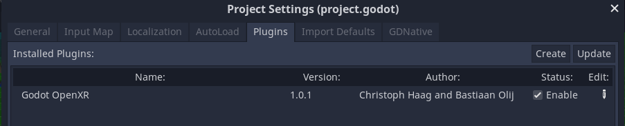

Enabling the OpenXR plugin
==========================

Due to the design of Rebel Engine's XR system, the plugin will always automatically load the OpenXR interface.
However, additional editor features will not be available unless the OpenXR plugin is enabled.

For this, go to **Project > Project Settings** and select the **Plugins** tab:

Make sure the **Enable** checkbox is checked.
